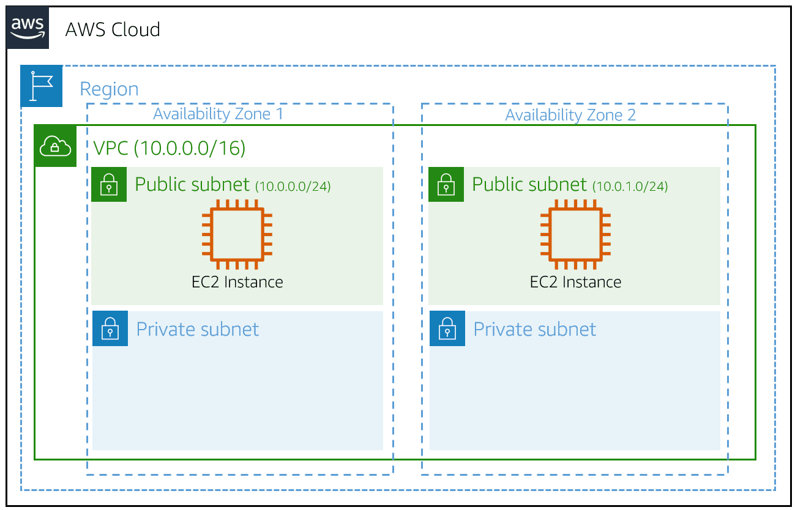
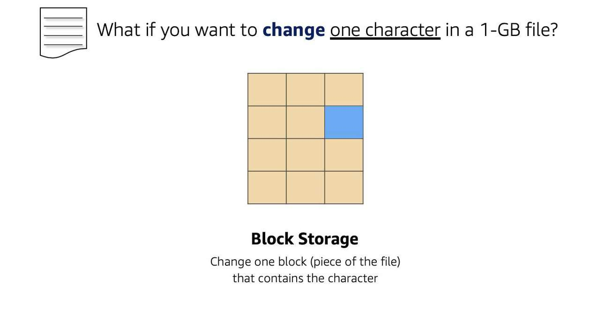

# AWS SOLUTIONS ARCHITECH

## INTRODUCTION TO AWS CORE TECHNOLOGIES

### Benefits of Cloud computing
- Agility
- Elasticity
- Cost savings
- Deploy globally in minutes

##### What is cloud computing
Cloud computing is on-demand delivery of compute power, database, storage, applications, 
and other IT resources via the internet with pay-as-you-go pricing.

##### AWS Global Infrastructure
###### Regions (multiple locations)
- Completely isolated from each other
- Certain resources tied to regions
- Each ZA isolated from other AZs within the region
- High-speed, low latency connection between AZs within a region


##### Core Technologies: Compute
- Amazon EC2: Resizable compute capacity
- Amazon EC2 Auto Scaling: Increase or decrease number of instances
- Elastic Load Balancing: Distribute incoming traffic
- Amazon Elastic Container Service: Run applications on a managed cluster
- Amazon Elastic Kubernetes Service: Run Kubernetes applications on AWS and on-premises
- AWS Lambda: Run code in response to events

###### Benefits of Amazon EC2
- Elasticity
- Control
- Flexibility
- Integrated
- Reliable
- Secure
- Cost-effective
- Easy to get started

###### Instance Types
- General purpose: Mac, T2, M6g, A1
- Compute optimized
- Memory optimized
- Accelerated Computing
- Storage optimized

###### Why Scaling Matters - Scaling on AWS
- Launch new instances in advance of peak periods
- Use monitoring to programmatically scale out
- Automatically scale in
- Pay for the resources needed, only when needed

###### Amazon EC2 Auto Scaling group
- Automatically adjusts resource capacity
- Define where Amazon EC2 Auto Scaling deploys resources
- Specify the Amazon VPC and subnets

ASG are configured based on Minimum, Maximum, and desired capacity

###### Amazon Elastic Load Balancing - ELB
- Automatically distribute traffic across multiple EC2 instances
  - Increase availability and fault tolerance
  - Configure health checks
  - Offload encryption and decryption
- Types:
  - Application Load Balancer (app layer)
  - Network Load Balancer (network layer)
  - Gateway Load Balancer (third-party virtual appliances)

##### Core Technologies: Storage
A reliable, scalable, and secure place for data
- Amazon Elastic Block Store: Persistent block-level storage
- Amazon S3: Durable scalable object storage
- Amazon S3 Glacier: Data archiving and backup
- AWS Storage Gateway: Integrate cloud storage with on-site workloads
- Amazon Elastic File System: File storage for Amazon EC2 instances
- Amazon FSx: File storage for widely-used file systems.

###### Amazon Elastic Block Store (EBS)
Network-attached block storage for use with Amazon EC2 instances.
- Persist independently from instance
- Used like a physical hard drive
- Automatically replicated
- Attached to any instance in the same AZ
- One EBS volume to one EC2 instance
- One instance to many EBS volumes
- EBS volumes can retain data after EC2 instance termination.
- Allow point-in-time snapshots to S3 GiB increments

###### Amazon Simple Storage Service (Amazon S3)
- Infinite scalability, greater analysis, and faster data retrieval
- Highly scalable object storage with 99.9999% durabilitdy and 99.99% availability
- Comon S3 use cases:
  - Data lakes
  - Backup and storage
  - Application hosting
  - Media hosting
  - Software delivery
  
###### Storage classes on Amazon S3
- Amazon S3 Standard
- Amazon S3 Standard-Infrequent Access
- Amazon S3 One Zone-Infrequent Access
- S3 Glacier storage classes
- S3 Intelligent-Tiering automatically moves objects between tiers based on access patterns.
 
##### Core Technologies: Databases
Purpose-build for specific application use cases
Offload time-consuming management tasks

- Amazon RDS: Cost-efficient and resizable capacity. Incluses 6 popular database engines like: Amazon Aurora, Postgresql, mysql, mariadb, oracle, sql server
- Amazon DynamoDB: A no SQL database, fast and predictable performance. 
- Amazon ElastiCache: A cache service. Fast, managed information retrieval.

###### EC2-hosted vs AWS Database Services
- AWS Database Service
  - Easy to set up, manage, maintain
  - Reduce undifferentiated heavy lifting
  - Push-button high availability
  - Automatic backup/recovery
  - Scale up or down based upon pattern
- Databases on Amazon EC2
  - More control/flexibility
  - Operating system access
  - Need features of specific application

##### Core Technologies: Networking
Isolate cloud infrastructure and scale request-handling capacity
- Amazon VPC: Build a virtual network in the cloud
- Security Groups: Control access to instances
- Network Access Control Lists (NACL): Controls access to subnets
- Amazon Route 53: Route end users to internet applications

###### Amazon Virtual Private Cloud (VPC)

Amazon Virtual Private Cloud (VPC)
- Networking layer for AWS resources
- A virtual network dedicated to a customer's AWS account

Subnet
- A range of IP addresses in a VPC

Securing a VPC
- Network Access Control Lists: control traffic at the subnet level
- Security Groups: control traffic at the instance level
- Flow logs: Capture network flow information
- Host-based firewalls: Operating system firewalls

##### Core Technologies: Security
Cloud security at AWS is the highest priority
- Inherit benefits from AWS data center and network architecture
- Similar to on premises data centers, without maintaining facilities and hardware
- Can be easily automated
- Inherit all the best practices of AWS

###### Security, identity, and compliance services
- Infrastructure Protection: Inspect and filter traffic to prevent unauthorized resource access at the host, network and application level boundaries
  - AWS Network Firewall
  - AWS Shield
  - AWS WAF
  - AWS Firewall
- Identity & access management: Enables customer's to securily manage identities, resources and permissions, network and application protection services 
  - AWS IAM
  - AWS Single Sign-on
  - AWS Organizations
  - AWS Resource Access Manager
  - AWS Directory Service
  - Amazon Cognito
- Detection: Infrastructure protection, data protection, incidense response and compliance
  - Amazon GuardDuty
  - Amazon Inspector
  - AWS CloudTrail
  - AWS Security Hub
  - AWS Config
  - AWS IoT Device Defender
- Data Protection: AWS provides services to protect data, accounts, and workloads from unauthorized access. Provides encryption, key management and thread detection. 
  - Amazon Macie
  - AWS CloudHSM
  - AWS Secrets Manager
  - AWS KMS
  - AWS Certificate Manager
- Compliance: 
  - AWS Artifact
  - AWS Audit Manager 
- Incident Response
  - Amazon Detective
  - CloudEndure Disaster Recovery

###### Amazon Identity and Access Management (IAM)
Securely manage access to AWS services and resources
- Fine-grained access control to AWS resources
- Multi-factor authentication
- The ability to analyze access
- Integration with corporate directories

###### AWS Cloud compliance
- Sharing information
  - Industry certifications
  - Security and control practices
  - Compliance reports directly under NDA
- Assurance Programs
  - Certifications and attestations
  - Laws, regulations, and privacy
  - Alignments and frameworks

##### Summary
- AWS management interfaces
  - AWS Management Console: Graphical web interface to facilitate cloud management
  - Command Line Interfaces (AWS CLI): Access to services via commands
  - Software Development Kits (SDKs): Access services in your code.


##### Knowledge Check and Resources
- Availability Zone: Separate geographical area within an AWS Region, designed to facilitate high availability.
- Amazon Elastic Block Store (Amazon EBS): Block storage for Amazon EC2 instances
- Amazon EC2 Auto Scaling: Service maintaining the availabilityof resources by increasing or decreasing capacity
- Security Group: Virtual firewall providing security at the instance level.

###### Resouces:
- What is cloud computing? https://docs.aws.amazon.com/whitepapers/latest/aws-overview/what-is-cloud-computing.html
- Global infrastructure: https://aws.amazon.com/about-aws/global-infrastructure/
- Compute for any workload: https://aws.amazon.com/products/compute/
- Amazon EC2 Instance Types: https://aws.amazon.com/ec2/instance-types/
- Elastic Load Balancing: https://aws.amazon.com/elasticloadbalancing/
- Cloud Storage on AWS: https://aws.amazon.com/products/storage/
- Amazon S3: https://aws.amazon.com/s3/
- Amazon S3 Storage Classes: https://aws.amazon.com/s3/storage-classes
- AWS Cloud Databases: https://aws.amazon.com/products/databases/
- AWS Networking and Content Delivery: https://aws.amazon.com/products/networking/
- Security best practices for you VPC: https://aws.amazon.com/answers/networking/vpc-security-capabilities/
- Security and Compliance: https://docs.aws.amazon.com/whitepapers/latest/aws-overview/security-and-compliance.html
- Security, Identity, and Compliance on AWS: https://aws.amazon.com/products/security/
- Shared Responsability Model: https://aws.amazon.com/compliance/shared-responsibility-model/
- AWS Identity and Access Management (IAM): https://aws.amazon.com/iam/
- AWS Compliance: http://aws.amazon.com/compliance/
- AWS Documentation: https://docs.aws.amazon.com/
- Cloud Products: https://aws.amazon.com/products/


## FROM SERVICES TO SOLUTIONS

### Introduction to Solution Design

##### AWS Solutions
- Machine Learning
- Analytics & Data Lakes
- Internet of Things
- Serverless Computing
- Containers
- Enterprise Applications
- Storage
- Windows workloads

##### Addressing Customer Challenges

##### Migration Strategies
- Rehost (lift and shift): 
  - Recreating the on-premises network, only hosted on AWS
  - Automating with tools such as AWS application migration service
- Replatform
  - It is the same than rehosting where the core architecture doesn't change
  - Retains the core architecture
  - Making targeted AWS cloud optimizations
  - Examples
    - Migrating databases to Amazon RDS
	- Migrating applications to Amazon Elastic Beanstalk
- Relocate (hypervisor-level lift and shift)
  - The same as rehost but at hypervisor level
  - Migration specific to VMWare Cloud on AWS
  - Example:
    - Migrate the hypervisor host
- Refactor (Modernize)
  - Re-imagining how the application is architected and developed
  - Using cloud-native features
- Retire
  - Shutting off non-useful applications
  - Reducing spend, management, and security
- Retain
  - Keeping certain applications on-premises
- Repurchase
  - Moving workflows to software as a service (SaaS)

##### Architectural Best Practices

1. Design for failure and nothing fails
  - Avoid single points of failure
  - Multiple instances
  - Multiple Availability Zones
  - Separate single server into multiple tiered application
  - For Amazon RDS, use Multi-AZ feature
2. Build security in every layer
  - Encrypt data at rest and in transit
  - Enforce principle of least privilege in IAM
  - Implement both Security Groups and Network Access Control Lists (NACL)
  - Consider advanced security features and services
3. Leverage different storage options
  - Move static web assets to Amazon S3
  - Use Amazon CloudFront to serve globally
  - Store session state in DynamoDB
  - User ElasticCache between host and databases
4. Implement elasticity
  - Implement auto scaling policies
  - Architect resiliency to reboot and relaunch
5. Think parallel
  - Scale horizontally, not vertically
  - Decouple compute from session/state
  - Uses Elastic Load Balancer
6. Loose coupling sets you free
  - Instad of a single, ordered workflow, use multiple queues
  - Use Amazon simple queue service
7. Don't fear constraints
  - Rethink traditional constraints
  - Need more RAM?
  - Better IOPS for databases?
  - Response to failure?

- Rightsizing instances
  - Rightsizing is the process of reviewing deployed resources and seeking 
  opportunities to downsize when possible. For example, if an application 
  instance is consistently underutilizing its RAM and CPU, switching that 
  to a smaller instance can offer significant savings while maintaining 
  the same performance.
- Increasing application elasticity
  - An example is using auto scaling to ensure that the correct number of 
  instances are available to handle the workload of an application. Scale 
  out during high demand and scale in during low demand.
- Choosing the right pricing model
  - An example is using Reserved Instances for workloads that need to run 
  most or all the time, such as production environments. This can have a 
  significant impact on savings compared to on-demand; in some cases, up 
  to 75 percent.
Optimizing storage
An example is the S3 Intelligent-Tiering storage class, which is designed to optimize costs by automatically moving data to the most cost-effective storage tier.


##### Resources in this section
- AWS Application Migration Service: https://aws.amazon.com/application-migration-service/
- AWS Well-Architected: https://aws.amazon.com/architecture/well-architected/?wa-lens-whitepapers.sort-by=item.additionalFields.sortDate&wa-lens-whitepapers.sort-order=desc&wa-guidance-whitepapers.sort-by=item.additionalFields.sortDate&wa-guidance-whitepapers.sort-order=desc
- Cloud Economics Center: https://aws.amazon.com/economics/
- AWS Cloud Adoption Framework: https://aws.amazon.com/professional-services/CAF/
- An Overview of the AWS Cloud Adoption Framework: https://d1.awsstatic.com/whitepapers/es_ES/aws-cloud-adoption-framework_XL.pdf
- Customer Success Stories: https://aws.amazon.com/solutions/case-studies/?customer-references-cards.sort-by=item.additionalFields.sortDate&customer-references-cards.sort-order=desc&awsf.content-type=*all&awsf.customer-references-location=*all&awsf.customer-references-segment=*all&awsf.customer-references-industry=*all&awsf.customer-references-use-case=*all&awsf.customer-references-tech-category=*all&awsf.customer-references-product=*all
- AWS Solutions Library: https://aws.amazon.com/solutions/
- AWS Solutions Consulting Offers: https://aws.amazon.com/solutions/consulting-offers/?solutions-consulting-offers-cards.sort-by=item.additionalFields.sortDate&solutions-consulting-offers-cards.sort-order=desc&awsf.solutions-consulting-offers-filter-tech=*all&awsf.solutions-consulting-offers-filter-industry=*all&awsf.solutions-consulting-offers-filter-region=*all
- AWS Quick Starts: https://aws.amazon.com/quickstart/?solutions-all.sort-by=item.additionalFields.sortDate&solutions-all.sort-order=desc&awsf.filter-content-type=*all&awsf.filter-tech-category=*all&awsf.filter-industry=*all


## AWS Tecnical Essentials
#### What is AWS
##### Six advantages of cloud computing
- Pay as you go: Instead of investing in data centers and hardware before you know how you are going to use them, you pay only when you use computing resources, and pay only for how much you use.
- Benefit from massive economies of scale: By using cloud computing, you can achieve a lower cost than you can get on your own. Because usage from hundreds of thousands of customers is aggregated in the cloud, AWS can achieve higher economies of scale, which translates into lower pay as-you-go prices.
- Stop guessing capacity: Eliminate guessing on your infrastructure capacity needs. When you make a capacity decision prior to deploying an application, you often end up either sitting on expensive idle resources or dealing with limited capacity. With cloud computing, these problems go away. You can access as much or as little capacity as you need, and scale up and down as required with only a few minutes notice.
- Increase speed and agility: IT resources are only a click away, which means that you reduce the time to make resources available to your developers from weeks to minutes. This results in a dramatic increase in agility for the organization, since the cost and time it takes to experiment and develop is significantly lower.
- Realize cost savings: Companies can focus on projects that differentiate their business instead of maintaining data centers. Cloud computing lets you focus on your customers, rather than on the heavy lifting of racking, stacking, and powering physical infrastructure. This is often referred to as undifferentiated heavy lifting.
- Go global in minutes: Applications can be deployed in multiple Regions around the world with a few clicks. This means that you can provide lower latency and a better experience for your customers at a minimal cost.

##### Resources
- https://aws.amazon.com/what-is-cloud-computing/
- http://docs.aws.amazon.com/whitepapers/latest/aws-overview/types-of-cloud-computing.html
- https://aws.amazon.com/what-is-aws/
- https://docs.aws.amazon.com/whitepapers/latest/aws-overview/aws-overview.pdf

#### AWS Global Infrastructure
##### AWS Region Considerations
When you decide which AWS Region to host your applications and workloads, consider four main aspects – latency, price, service availability, and compliance.

- Compliance: Enterprise companies often must comply with regulations that require customer data to be stored in a specific geographic territory. If applicable, choose a Region that meets your compliance requirements.
- Latency: If your application is sensitive to latency (the delay between a request for data and the response), choose a Region that is close to your user base. This helps prevent long wait times for your customers. Synchronous applications such as gaming, telephony, WebSockets, and Internet of Things (IoT) are significantly affected by high latency. Asynchronous workloads, such as ecommerce applications, can also suffer from user connectivity delays.
- Pricing: Due to the local economy and the physical nature of operating data centers, prices vary from one Region to another. Internet connectivity, imported equipment costs, customs, real estate, and other factors impact a Region's pricing. Instead of charging a flat rate worldwide, AWS charges based on the financial factors specific to each Region.
- Service availability: Some services might not be available in some Regions. The AWS documentation provides a table that shows the services available in each Region.

##### Infrastructure
Infrastructure, like data centers and networking connectivity, still exists as the foundation of every cloud application. In AWS, this physical infrastructure makes up the AWS Global Infrastructure, in the form of Regions and Availability Zones.

##### Regions
Regions are geographic locations worldwide where AWS hosts its data centers. AWS Regions are named after the location where they reside. For example, in the United States, the Region in Northern Virginia is called the Northern Virginia Region, and the Region in Oregon is called the Oregon Region. AWS has Regions in Asia Pacific, Canada, Europe, the Middle East, and South America, and we continue to expand to meet our customers' needs.

Each AWS Region is associated with a geographical name and a Region code.

AWS Regions are independent from one another. Data is not replicated from one Region to another, without explicit customer consent and authorization.

##### Availability Zones
Inside every Region is a cluster of Availability Zones (AZs). An AZ consists of one or more data centers with redundant power, networking, and connectivity. These data centers operate in discrete facilities in undisclosed locations. They are connected using redundant high-speed and low-latency links.

AZs also have a code name. Since they are located inside Regions, they can be addressed by appending a letter to the end of the Region code name. For example:

us-east-1a: An AZ in us-east-1 (N. Virginia Region)
sa-east-1b: An AZ in sa-east-1 (São Paulo Region)

Therefore, if you see that a resource exists in us-east-1c, you can infer that the resource is located in AZ c of the us-east-1 Region.

##### Scope AWS Services
Depending on the AWS service you use, your resources are either deployed at the AZ, Region, or Global level. Each service is different, so you must understand how the scope of a service might affect your application architecture.

When you operate a Region-scoped service, you only need to select the Region you want to use. If you are not asked to specify an individual AZ to deploy the service in, this is an indicator that the service operates on a Region-scope level. For Region-scoped services, AWS automatically performs actions to increase data durability and availability.

On the other hand, some services ask you to specify an AZ. With these services, you are often responsible for increasing the data durability and high availability of these resources.

##### Maintain Resiliency
To keep your application available, you must maintain high availability and resiliency. A well-known best practice for cloud architecture is to use Region-scoped, managed services. These services come with availability and resiliency built in. When that is not possible, make sure your workload is replicated across multiple AZs. At a minimum, you should use two AZs. That way, if an AZ fails, your application will have infrastructure up and running in a second AZ to take over the traffic.

##### Resources
- https://aws.amazon.com/about-aws/global-infrastructure/
- https://docs.aws.amazon.com/whitepapers/latest/aws-overview/global-infrastructure.html
- https://aws.amazon.com/about-aws/global-infrastructure/regions_az/
- https://docs.aws.amazon.com/general/latest/gr/rande.html
- https://aws.amazon.com/about-aws/global-infrastructure/regional-product-services/


#### Interacting with AWS
Every action you make in AWS is an API call that is authenticated and authorized. In AWS, you can make API calls to services and resources through the AWS Management Console, AWS Command Line Interface (AWS CLI), or AWS software development kits (SDKs).

##### The AWS Management Console
One way to manage cloud resources is through the web-based console, where you log in and choose the desired service. This can be the easiest way to create and manage resources when you first begin working with the cloud. Below is a screenshot that shows the landing page when you first log in to the AWS Management Console. 

The services are placed in categories, such as Compute, Storage, Database, and Analytics

On the upper-right corner is the Region selector. If you choose it and change the Region, you will make requests to the services in the chosen Region. The URL changes, too. Changing the Region setting directs your browser to make requests to a different AWS Region, represented by a different subdomain.

##### The AWS Command Line Interface (AWS CLI)
Consider the scenario where you run tens of servers on AWS for your application’s front end. You want to run a report to collect data from all the servers. You need to do this programmatically every day because the server details might change. Instead of manually logging in to the AWS Management Console and then copying and pasting information, you can schedule an AWS CLI script with an API call to pull this data for you.

The AWS CLI is a unified tool that you can use to manage AWS services. You can download and configure one tool that you can use to control multiple AWS services from the command line and automate them with scripts. The AWS CLI is open-source, and installers are available for Windows, Linux, and macOS.

For example, if you run the following API call against a service using AWS CLI:

`aws ec2 describe-instances`

you will get the following response:

```
{
"Reservations": [
{
"Groups": [],
"Instances": [
{
"AmiLaunchIndex": 0,
```

##### AWS SDKs
API calls to AWS can also be performed by running code with programming languages. You can do this by using AWS software development kits (SDKs). SDKs are open source and maintained by AWS for the most popular programming languages, such as C++, Go, Java, JavaScript, .NET, Node.js, PHP, Python, and Ruby.

Developers commonly use AWS SDKs to integrate their application source code with AWS services. For example, consider an application with a front end that runs in Python. Every time the application receives a cat photo, it uploads the file to a storage service. This action can be achieved in the source code by using the AWS SDK for Python. Here is an example of code you can implement to work with AWS resources using the Python AWS SDK.

```
import boto3
ec2 = boto3.client('ec2')
response = ec2.describe_instances()
print(response)
```

##### Resouces
- https://docs.aws.amazon.com/awsconsolehelpdocs/latest/gsg/getting-started.html
- https://aws.amazon.com/cli/
- https://aws.amazon.com/tools/


#### Security and the AWS Shared Responsability Model
...
...
###### Customers
- Customer Data
- Platform, applications, identity and access management
- Operating Systems, Network and firewall configuration
- Client-side data encryption
- Server-side encryption
- Networking traffic protection
###### AWS
- Software
- Compute
- Storage
- Database
- Networking
- Hardware/AWS Global Infrastructure
- Regions, AZs, Edge locations

##### Resources
- https://aws.amazon.com/compliance/shared-responsibility-model/


#### Protect the AWS Root User
...
...

##### Resouces
- https://docs.aws.amazon.com/IAM/latest/UserGuide/id_credentials_mfa_enable_physical.html
- https://docs.aws.amazon.com/IAM/latest/UserGuide/id_credentials_mfa_enable_u2f.html
- https://docs.aws.amazon.com/IAM/latest/UserGuide/id_credentials_mfa_enable_virtual.html
- https://aws.amazon.com/iam/features/mfa/
- 


#### AWS Identity And Access Management
...
...

##### Resouces
- https://docs.aws.amazon.com/en_us/IAM/latest/UserGuide/introduction.html
- https://docs.aws.amazon.com/en_us/IAM/latest/UserGuide/id.html
- https://docs.aws.amazon.com/en_us/IAM/latest/UserGuide/access.html


#### Role-Based Access in AWS
Throughout these last few lessons, you have learned about some IAM best practices. This section summarizes some of the most important IAM best practices  that you must be familiar with before building solutions in AWS. 

Choose the + sign to read more about each best practice.

- Lock down the AWS root user
The root user is an all-powerful and all-knowing identity in your AWS account. If a malicious user were to gain control of root-user credentials, they would be able to access every resource in your account, including personal and billing information. To lock down the root user, you can do the following:

  - Don’t share the credentials associated with the root user
  - Consider deleting the root user access keys
  - Enable MFA on the root account

- Follow the principle of least privilege
Least privilege is a standard security principle that advises you to grant only the necessary permissions to do a particular job and nothing more. To implement least privilege for access control, start with the minimum set of permissions in an IAM policy and then grant additional permissions as necessary for a user, group, or role.

- User IAM appropriately
IAM is used to secure access to your AWS account and resources. It simply provides a way to create and manage users, groups, and roles to access resources in a single AWS account. IAM is not used for website authentication and authorization, such as providing users of a website with sign-in and sign-up functionality. IAM also does not support security controls for protecting operating systems and networks.

- Use IAM roles when possible
Maintaining roles is more efficient than maintaining users. When you assume a role, IAM dynamically provides temporary credentials that expire after a defined period of time, between 15 minutes and 36 hours. Users, on the other hand, have long-term credentials in the form of user name and password combinations or a set of access keys.

User access keys only expire when you or the account admin rotates the keys. User login credentials expire if you applied a password policy to your account that forces users to rotate their passwords.

- Consider using an identity provider
If you decide to make your cat photo application into a business and begin to have more than a handful of people working on it, consider managing employee identity information through an identity provider (IdP). Using an IdP, whether it's an AWS service such as AWS Single Sign-On or a third-party identity provider, provides a single source of truth for all identities in your organization.

You no longer have to create separate IAM users in AWS. You can instead use IAM roles to provide permissions to identities that are federated from your IdP. For example, you have an employee, Martha, who has access to multiple AWS accounts. Instead of creating and managing multiple IAM users named Martha in each of those AWS accounts, you could manage Martha in your company’s IdP. If Martha moves in the company or leaves the company, Martha can be updated in the IdP, rather than in every AWS account in the company.

- Consider AWS Single Sign-on
If you have an organization that spans many employees and multiple AWS accounts, you might want your employees to sign in with a single credential.

AWS SSO is an IdP that lets your users sign in to a user portal with a single set of credentials. It then provides users access to their assigned accounts and applications in a central location.

Similar to IAM. AWS SSO offers a directory where you can create users, organize them in groups, set permissions across the groups, and grant access to AWS resources. However, AWS SSO has some advantages over IAM. For example, if you’re using a third-party IdP, you can sync your users and groups to AWS SSO. This removes the burden of having to re-create users that already exist elsewhere, and it enables you to manage the users from your IdP. More importantly, AWS SSO separates the duties between your IdP and AWS, ensuring that your cloud access management is not inside or dependent on your IdP.


##### Resouces
- https://docs.aws.amazon.com/IAM/latest/UserGuide/best-practices.html
- https://aws.amazon.com/blogs/security/how-to-create-and-manage-users-within-aws-sso/


### Module 2 - AWS Compute
#### Compute as a Service
The first building block you need to host an application is a server. Servers usually can handle Hypertext Transfer Protocol (HTTP) requests and send responses to clients following the client-server model, although any API-based communication also falls under this model. A client is a person or computer that sends a request. A server handling the requests is a computer, or collection of computers, connected to the internet serving websites to internet users.

Servers power your application by providing CPU, memory, and networking capacity to process users’ requests and transform them into responses. For context, common HTTP servers include:
- Windows options, such as Internet Information Services (IIS)
- Linux options, such as Apache HTTP Web Server, Nginx, and Apache Tomcat

To run an HTTP server on AWS, you must find a service that provides compute power in the AWS Management Console. You can log in to the console and view the complete list of AWS compute services.

###### Choose the right compute options
If you’re responsible for setting up servers on AWS to run your infrastructure, you have many compute options. You need to know which service to use for which use case. At a fundamental level, three types of compute options are available – virtual machines (VMs), container services, and serverless.

If you have prior infrastructure knowledge, a virtual machine is often be the easiest compute option to understand. This is because a virtual machine emulates a physical server and allows you to install an HTTP server to run your applications. To run virtual machines, you install a hypervisor on a host machine. The hypervisor provisions the resources to create and run your VMs.

In AWS, virtual machines are called Amazon Elastic Compute Cloud, or Amazon EC2. Behind the scenes, AWS operates and manages the host machines and the hypervisor layer. AWS also installs the virtual machine operating system, called the guest operating system.

Some AWS compute services use Amazon EC2 or use virtualization concepts under the hood. You should understand this service before advancing to container services and serverless compute.

##### Resouces
- https://docs.aws.amazon.com/whitepapers/latest/aws-overview/compute-services.html
- https://aws.amazon.com/products/compute/
- https://aws.amazon.com/blogs/compute/

#### Amazon Elastic Compute Cloud
When launching an EC2 instance, the first setting you configure is which operating system you want by selecting an Amazon Machine Image (AMI).

###### Amazon Machine Image
In the traditional infrastructure world, the process of spinning up a server consists of installing an operating system from installation disks, installation drives, or installation wizards over the network. In the AWS Cloud, the operating system installation is not your responsibility. Instead, it's built into the AMI that you choose.

In addition, when you use an AMI, you can select storage mappings, the architecture type (such as 32-bit, 64-bit, or 64-bit ARM), and additional software installed.

###### Relationship between AMIs and EC2 instances
EC2 instances are live instantiations of what is defined in an AMI, much like a cake is a live instantiation of a cake recipe. If you are familiar with software development, you can also see this kind of relationship between a class and an object.


##### Resources
- https://aws.amazon.com/ec2/
- https://docs.aws.amazon.com/AWSEC2/latest/UserGuide/AMIs.html
- https://docs.aws.amazon.com/AWSEC2/latest/UserGuide/creating-an-ami-ebs.html
- https://docs.aws.amazon.com/imagebuilder/latest/userguide/what-is-image-builder.html


#### Amazon EC2 Instance Lifecycle
##### Instance families
| Instance Family | Description | Use Cases |
|:----------------|:------------|:----------|
|General purpose  | Provides a balance of compute, memory, and networking resources, and can be used for a variety of workloads. | Scale out workloads, such as web servers, containerized microservices, caching fleets, distributed data stores, and development environments |
| Compute optimized | Ideal for compute-bound applications that benefit from high-performance processors. | High-performance web servers, scientific modeling, batch processing, distributed analytics, high-performance computing (HPC), machine/deep learning, ad serving, highly scalable multiplayer gaming |
| Memory optimized | Designed to deliver fast performance for workloads that process large datasets in memory. | Memory-intensive applications, such as high-performance databases, distributed web-scale in-memory caches, mid-size in-memory databases, real-time big-data analytics, and other enterprise applications |
| Accelerated computing | Use hardware accelerators or co-processors to perform functions such as floating-point number calculations, graphics processing, or data pattern matching more efficiently than is possible with conventional CPUs. | 3D visualizations, graphics-intensive remote workstations, 3D rendering, application streaming, video encoding, and other server-side graphics workloads |
| Storage optimized | Designed for workloads that require high, sequential read and write access to large datasets on local storage. They are optimized to deliver tens of thousands of low-latency random I/O operations per second (IOPS) to applications that replicate their data across different instances. | NoSQL databases, such as Cassandra, MongoDB, and Redis, in-memory databases, scale-out transactional databases, data warehousing, Elasticsearch, and analytics |

##### EC2 Instance lifecycle


1. When you launch an instance, it enters the **pending** state. When an instance is pending, billing has not started. At this stage, the instance is preparing to enter the running state. Pending is where AWS performs all actions needed to set up an instance, such as copying the AMI content to the root device and allocating the necessary networking components.
2. When your instance is **running**, it's ready to use. This is also the stage where billing begins. As soon as an instance is running, you can take other actions on the instance, such as reboot, terminate, stop, and stop-hibernate.
3. When you reboot an instance, it’s different than performing a stop action and then a start action. **Rebooting** an instance is equivalent to rebooting an operating system. The instance remains on the same host computer, and maintains its public and private IP address, in addition to any data on its instance store.
4. It typically takes a few minutes for the reboot to complete. When you stop and start an instance, your instance may be placed on a new underlying physical server. Therefore, you lose any data on the instance store that were on the previous host computer. When you stop an instance, the instance gets a new public IP address but maintains the same private IP address. 

##### Pricing
###### Pay as you go with On-Demand Instances
With On-Demand Instances, you pay for compute capacity with no long-term commitments. Billing begins whenever the instance is running, and billing stops when the instance is in a stopped or terminated state. The price per second for a running On-Demand Instance is fixed.

For applications that require servers to be running all the time, you are less likely to benefit from the On-Demand pricing model, simply because there is no situation where you will need to turn servers off. For example, you might want the web server hosting the front end of your corporate directory application to be running 24/7 so that users can access the website at any time. Even if no users are connected to your website, you don’t want to shut down the servers supporting the site in case of potential user activity.

In the case when servers cannot be stopped, consider using a Reserved Instance to save on costs.

###### Reserve capacity with Reserved Instances (RIs)
RIs provide you with a significant discount compared to On-Demand Instance pricing. RIs provide a discounted hourly rate and an optional capacity reservation for EC2 instances. You can choose between three payment options – All Upfront, Partial Upfront, or No Upfront. You can select either a 1-year or 3-year term for each of these options.

Depending on which option you choose, you are discounted differently.

- All Upfront offers a higher discount than Partial Upfront instances.
- Partial Upfront instances offer a higher discount than No Upfront.
- No Upfront offers a higher discount than On-Demand.

On-Demand and No Upfront are similar, since both do not require any upfront payment. However, there is a major difference. When you choose an On-Demand Instance, you stop paying for the instance when you stop or terminate the instance. When you stop an RI, you still pay for it because you committed to a 1-year or 3-year term.

Reserved Instances are associated with an instance type and an Availability Zone depending on how you reserve it. The discount applied by a Reserved Instance purchase is not directly associated with a specific instance ID, but with an instance type.

###### Save on costs with Spot Instances
Another way to pay for EC2 instances is by using Spot Instances. Amazon EC2 Spot Instances allow you to take advantage of unused EC2 capacity in the AWS Cloud. They are available at up to a 90% discount compared to On-Demand prices.

With Spot Instances, you set a limit on how much you would like to pay for the instance hour. This is compared against the current Spot price that AWS determines. If the amount you pay is more than the current Spot price and there is capacity, then you will receive an instance. While they are very promising from the billing perspective, you must account for some architectural considerations to use them effectively.

One consideration is that your Spot Instance might be interrupted. For example, if AWS determines that capacity is no longer available for a particular Spot Instance or if the Spot price exceeds how much you are willing to pay, AWS will give you a 2-minute warning before it interrupts your instance. That means any application or workload that runs on a Spot Instance must be able to be interrupted.

Because of this unique consideration, inherently fault-tolerant workloads are typically good candidates to use with Spot Instances. These include big data, containerized workloads, continuous integration/continuous delivery (CI/CD), web servers, high-performance computing (HPC), image and media rendering, and other test and development workloads.

##### Resources
- https://aws.amazon.com/ec2/
- https://docs.aws.amazon.com/vpc/latest/userguide/default-vpc.html
- https://d1.awsstatic.com/whitepapers/architecture/AWS-Reliability-Pillar.pdf
- https://docs.aws.amazon.com/AWSEC2/latest/UserGuide/ec2-instance-lifecycle.html
- https://aws.amazon.com/ec2/pricing/
- https://aws.amazon.com/ec2/pricing/on-demand/
- https://aws.amazon.com/ec2/spot/pricing/
- https://aws.amazon.com/ec2/pricing/reserved-instances/pricing/


#### Container Services
...
...
##### Manage containers with Amazon Elastic Container Service (Amazon ECS)
To run and manage your containers, you need to install the Amazon ECS container agent on your EC2 instances. This agent is open source and responsible for communicating to the Amazon ECS service about cluster management details. You can run the agent on both Linux and Windows AMIs. An instance with the container agent installed is often called a container instance.

To prepare your application to run on Amazon ECS, you create a task definition. The task definition is a text file, in JSON format, that describes one or more containers. A task definition is similar to a blueprint that describes the resources you need to run a container, such as CPU, memory, ports, images, storage, and networking information.

Here is a simple task definition that you can use for your corporate directory application. In this example, this runs on the Nginx web server.

```json
{
"family": "webserver",
"containerDefinitions": [ {
"name": "web",
"image": "nginx",
"memory": "100",
"cpu": "99"
} ],
"requiresCompatibilities": [ "FARGATE" ],
"networkMode": "awsvpc",
"memory": "512",
"cpu": "256"
}
```

##### Use Kubernetes with Amazon Elastic Kubernetes Service (Amazon EKS)
If you already use Kubernetes, you can use Amazon EKS to orchestrate the workloads in the AWS Cloud. Amazon EKS is conceptually similar to Amazon ECS, but with the following differences:

- An EC2 instance with the ECS agent installed and configured is called a container instance. In Amazon EKS, it is called a worker node.
- An ECS container is called a task. In Amazon EKS, it is called a pod.
- While Amazon ECS runs on AWS native technology, Amazon EKS runs on top of Kubernetes.

If you have containers running on Kubernetes and want an advanced orchestration solution that can provide simplicity, high availability, and fine-grained control over your infrastructure, Amazon EKS could be the tool for you.

##### Resources
- https://aws.amazon.com/containers/services/
- https://www.docker.com/resources/what-container
- https://aws.amazon.com/ecs/
- https://github.com/aws/amazon-ecs-agent
- https://docs.aws.amazon.com/AmazonECS/latest/developerguide/ECS_instances.html
- https://www.coursera.org/learn/containerized-apps-on-aws


#### AWS Lambda
##### Remove the undifferentiated heavy lifting
If you run your code on Amazon EC2, AWS is responsible for the physical hardware, and you are responsible for the logical controls, such as guest operating system, security and patching, networking, security, and scaling.

If you run your code in containers on Amazon ECS and Amazon EKS, AWS is responsible for more of the container management, such as deploying containers across EC2 instances and managing the container cluster. However, when running ECS and EKS on EC2, you are still responsible for maintaining the underlying EC2 instances.

If you want to deploy your workloads and applications without having to manage any EC2 instances, you can do that on AWS with serverless compute.

##### Go serverless

Every definition of serverless mentions the following four aspects:

- No servers to provision or manage
- Scales with usage
- You never pay for idle resources
- Availability and fault tolerance are built-in

With serverless, you can spend time on the things that differentiate your application, rather than spend time on ensuring availability, scaling, and managing servers.

AWS has several serverless compute options, including AWS Fargate and AWS Lambda.

##### Explore serverless containers with AWS Fargate
Amazon ECS and Amazon EKS enable you to run your containers in the following two modes:

- Amazon EC2 mode
- AWS Fargate mode

Fargate abstracts the EC2 instance so that you’re not required to manage it. However, with Fargate, you can use all the same ECS primitives, APIs, and AWS integrations. It natively integrates with AWS Identity and Access Management (IAM) and Amazon Virtual Private Cloud (VPC). Having native integration with Amazon VPC allows you to launch Fargate containers inside your network and control connectivity to your applications.

##### Run code on AWS Lambda

If you want to deploy your workloads and applications without having to manage any EC2 instances or containers, you can use AWS Lambda.

AWS Lambda requires zero administration from the user. You upload your source code, and Lambda takes care of everything required to run and scale your code with high availability. There are no servers to manage, bringing you continuous scaling with subsecond metering and consistent performance.

###### How AWS Lambda works

A Lambda function has three primary components – trigger, code, and configuration. 


The code is source code that describes what the Lambda function should run. It can be authored in three ways.

- You create the code from scratch.
- You use a blueprint that AWS provides.
- You use some code from the AWS Serverless Application Repository, a resource that contains sample applications, such as “hello world” code, Amazon Alexa Skill sample code, image resizing code, video encoding, and more.

Triggers describe when a Lambda function should run. A trigger integrates your Lambda function with other AWS services, enabling you to run your Lambda function in response to certain API calls that occur in your AWS account. This increases your ability to respond to events in your console without having to perform manual actions. All you need is the what, how, and when of a Lambda function to have functional compute capacity that runs only when you need it to.

##### Billing granularity
AWS Lambda lets you run code without provisioning or managing servers, and you pay only for what you use. You are charged for the number of times your code is triggered (requests) and for the time your code executes, rounded up to the nearest 1 ms (duration).

AWS rounds up duration to the nearest millisecond with no minimum execution time. With this pricing, it can be cost effective to run functions whose execution time is very low, such as functions with durations under 100 ms or low latency APIs. Read more here: https://aws.amazon.com/blogs/aws/new-for-aws-lambda-1ms-billing-granularity-adds-cost-savings/

##### Source Code Example
You can find a tutorial on creating the AWS Lambda function as well as the code used in the AWS Lambda demo here: https://aws.amazon.com/blogs/compute/resize-images-on-the-fly-with-amazon-s3-aws-lambda-and-amazon-api-gateway/

##### Sources
- https://aws.amazon.com/serverless/#:~:text=Serverless%20is%20the%20native%20architecture,services%20without%20thinking%20about%20servers.
- https://www.coursera.org/learn/building-modern-python-applications-on-aws
- https://aws.amazon.com/serverless/resources/?serverless.sort-by=item.additionalFields.createdDate&serverless.sort-order=desc
- https://aws.amazon.com/lambda/serverless-architectures-learn-more/
- https://aws.amazon.com/blogs/compute/best-practices-for-organizing-larger-serverless-applications/
- https://docs.aws.amazon.com/lambda/latest/dg/lambda-functions.html
- https://aws.amazon.com/blogs/architecture/ten-things-serverless-architects-should-know/
- https://alienattack.workshop.aws/


### Module 3: AWS Networking
#### Networking
Networking is how you connect computers around the world and allow them to communicate with one another. In this course, you’ve already seen a few examples of networking. One is the AWS Global Infrastructure. AWS built a network of resources using data centers, Availability Zones, and Regions. 

##### CIDR notation

192.168.1.30 is a single IP address. If you want to express IP addresses between the range of 192.168.1.0 and 192.168.1.255, how can you do that?

One way is to use Classless Inter-Domain Routing (CIDR) notation. CIDR notation is a compressed way of specifying a range of IP addresses. Specifying a range determines how many IP addresses are available to you.

CIDR notation is shown here.


The higher the number after the /, the smaller the number of IP addresses in your network. For example, a range of 192.168.1.0/24 is smaller than 192.168.1.0/16.

When working with networks in the AWS Cloud, you choose your network size by using CIDR notation. In AWS, the smallest IP range you can have is /28, which provides 16 IP addresses. The largest IP range you can have is a /16, which provides 65,536 IP addresses.

##### Resources
- https://web.stanford.edu/class/cs101/network-1-introduction.html
- https://en.wikipedia.org/wiki/Classless_Inter-Domain_Routing
- https://cidr.xyz/

#### Amazon Virtual Private Cloud
##### Amazon VPC
A virtual private cloud (VPC) is an isolated network that you create in the AWS Cloud, similar to a traditional network in a data center. When you create a VPC, you must choose three main factors:

- Name of the VPC.
- Region where the VPC will live. Each VPC spans multiple Availability Zones within the selected Region.
- IP range for the VPC in CIDR notation. This determines the size of your network. Each VPC can have up to four /16 IP ranges.

Using this information, AWS will provision a network and IP addresses for that network.


##### Create a subnet

After you create your VPC, you must create subnets inside the network. Think of subnets as smaller networks inside your base network – or virtual local area networks (VLANs) in a traditional, on-premises network. In an on-premises network, the typical use case for subnets is to isolate or optimize network traffic. In AWS, subnets are used to provide high availability and connectivity options for your resources.

When you create a subnet, you must specify the following:

- VPC you want your subnet to live in. In this case: VPC (10.0.0.0/16)
- Availability Zone you want your subnet to live in. In this case: AZ1
- CIDR block for your subnet, which must be a subset of the VPC CIDR block. In this case: 10.0.0.0/24

When you launch an EC2 instance, you launch it inside a subnet, which will be located inside the Availability Zone you choose.


##### High availability with a VPC

When you create your subnets, keep high availability in mind. To maintain redundancy and fault tolerance, create at least two subnets configured in two Availability Zones.

As you learned earlier, remember that “everything fails all of the time.” With the example network, if one of the AZs fails, you will still have your resources available in another AZ as backup.



##### Reserved IPs

For AWS to configure your VPC appropriately, AWS reserves five IP addresses in each subnet. These IP addresses are used for routing, Domain Name System (DNS), and network management.

For example, consider a VPC with the IP range 10.0.0.0/22. The VPC includes 1,024 total IP addresses. This is divided into four equal-sized subnets, each with a /24 IP range with 256 IP addresses. Out of each of those IP ranges, there are only 251 IP addresses that can be used because AWS reserves five.


The five reserved IP addresses can impact how you design your network. A common starting place for those who are new to the cloud is to create a VPC with an IP range of /16 and create subnets with an IP range of /24. This provides a large amount of IP addresses to work with at both the VPC and subnet levels.

##### Gateways

###### Internet gateway
To enable internet connectivity for your VPC, you must create an internet gateway. Think of the gateway as similar to a modem. Just as a modem connects your computer to the internet, the internet gateway connects your VPC to the internet. Unlike your modem at home, which sometimes goes down or offline, an internet gateway is highly available and scalable. After you create an internet gateway, you attach it to your VPC.

###### Virtual private gateway
A virtual private gateway connects your AWS VPC to another private network. Once you create and attach a virtual private gateway to a VPC, the gateway acts as anchor on the AWS side of the connection. On the other side of the connection, you will need to connect a customer gateway to the other private network. A customer gateway device is a physical device or software application on your side of the connection. Once you have both gateways, you can then establish an encrypted VPN connection between the two sides.

##### Resources
- https://docs.aws.amazon.com/vpc/latest/userguide/VPC_Scenario2.html
- https://docs.aws.amazon.com/vpc/latest/userguide/VPC_Route_Tables.html#CustomRouteTables
- https://docs.aws.amazon.com/vpn/latest/s2svpn/how_it_works.html#CustomerGateway
- https://docs.aws.amazon.com/vpc/latest/userguide/what-is-amazon-vpc.html
- https://docs.aws.amazon.com/vpc/latest/userguide/VPC_Subnets.html

#### Amazon VPC Routing

##### Main route table

When you create a VPC, AWS creates a route table called the main route table. A route table contains a set of rules, called routes, that are used to determine where network traffic is directed. AWS assumes that when you create a new VPC with subnets, you want traffic to flow between them. Therefore, the default configuration of the main route table is to allow traffic between all subnets in the local network. Below is an example of a main route table.

The destination and target are two main parts of this route table.

- The destination is a range of IP addresses where you want your traffic to go. In the example of sending a letter, you need a destination to route the letter to the appropriate place. The same is true for routing traffic. In this case, the destination is the VPC network's IP range.
- The target is the connection through which to send the traffic. In this case, the traffic is routed through the local VPC network.


##### Custom route tables

While the main route table is used implicitly by subnets that do not have an explicit route table association, you might want to provide different routes on a per-subnet basis, for traffic to access resources outside of the  VPC. For example, your application might consist of a front end and a database. You can create separate subnets for the resources and provide different routes for each of them.

If you associate a custom route table with a subnet, the subnet will use it instead of the main route table. Each custom route table you create will have the local route already inside it, allowing communication to flow between all resources and subnets inside the VPC. The local route cannot be deleted.


#### Amazon VPC Security

##### Secure subnets with network access control lists

Think of a network access control list (network ACL) as a firewall at the subnet level. A network ACL enables you to control what kind of traffic is allowed to enter or leave your subnet. You can configure this by setting up rules that define what you want to filter. Here’s an example.

**Inbound**
| Rule# | Type | Protocol | Port Range | Source | Allow/Deny |
|:------|:-----|:---------|:-----------|:-------|:-----------|
| 100   | All IPv4 Traffic | All | All | 0.0.0.0/0 | ALLOW |
| *   | All IPv4 Traffic | All | All | 0.0.0.0/0 | DENY |

**Outbound**
| Rule# | Type | Protocol | Port Range | Source | Allow/Deny |
|:------|:-----|:---------|:-----------|:-------|:-----------|
| 100   | All IPv4 Traffic | All | All | 0.0.0.0/0 | ALLOW |
| *   | All IPv4 Traffic | All | All | 0.0.0.0/0 | DENY |

The default network ACL, shown in the preceding table, allows all traffic in and out of the subnet. To allow data to flow freely to the subnet, this is a good starting place.

However, you might want to restrict data at the subnet level. For example, if you have a web application, you might restrict your network to allow HTTPS traffic and remote desktop protocol (RDP) traffic to your web servers.

**Inbound**
| Rule# | Source IP | Protocol | Port | Allow/Deny | Comments |
|:------|:-----|:---------|:-----------|:-------|:-----------|
| 100   | All IPv4 Traffic | TCP | 443 | ALLOW | Allows inbound HTTPS traffic from anywhere |
| 130   | 192.0.2.0/24 | TCP | 3389 | ALLOW | Allows inbound RDP traffic to the web servers from your home network’s public IP address range (over the internet gateway) |
| *   | All IPv4 Traffic | All | All | DENY | Denies all inbound traffic not already handled by a preceding rule (not modifiable) |

**Outbound**
| Rule# | Source IP | Protocol | Port | Allow/Deny | Comments |
|:------|:-----|:---------|:-----------|:-------|:-----------|
| 120   | 0.0.0.0/0 | TCP | 1025-65535 | ALLOW | Allows outbound responses to clients on the internet (serving people visiting the web servers in the subnet) |
| *   | 0.0.0.0/0 | All | All | DENY | Denies all outbound traffic not already handled by a preceding rule (not modifiable) |

Notice that in the preceding network ACL example, you allow inbound 443 and outbound range 1025–65535. That’s because HTTP uses port 443 to initiate a connection and will respond to an ephemeral port. Network ACLs are considered stateless, so you need to include both the inbound and outbound ports used for the protocol. If you don’t include the outbound range, your server would respond but the traffic would never leave the subnet.

Since network ACLs are configured by default to allow incoming and outgoing traffic, you don’t need to change their initial settings unless you need additional security layers.

##### Secure EC2 instances with security groups

The next layer of security is for your EC2 Instances. Here, you can create a firewall called a security group. The default configuration of a security group blocks all inbound traffic and allows all outbound traffic.


You might be wondering, “Wouldn’t this block all EC2 instances from receiving the response of any customer requests?” Well, security groups are stateful. That means that they will remember if a connection is originally initiated by the EC2 instance or from the outside, and temporarily allow traffic to respond without modifying the inbound rules.

If you want your EC2 instance to accept traffic from the internet, you must open up inbound ports. If you have a web server, you might need to accept HTTP and HTTPS requests to allow that type of traffic into your security group. You can create an inbound rule that will allow port 80 (HTTP) and port 443 (HTTPS), as shown.

**Inbound rules**
| Type | Protocol | Port Range | Source |
|:-----|:---------|:-----------|:-------|
| HTTP (80) | TCP (6) | 80 | 0.0.0.0/0 |
| HTTP (80) | TCP (6) | 80 | ::/0 |
| HTTPS (443) |	TCP (6) | 443 | 0.0.0.0/0 |
| HTTPS (443) | TCP (6) | 443 | ::/0 |

You learned in a previous unit that subnets can be used to segregate traffic between computers in your network. Security groups can be used in the same way. A common design pattern is to organize resources into different groups and create security groups for each to control network communication between them.


This example defines three tiers and isolates each tier with defined security group rules. In this case, internet traffic to the Web Tier is allowed over HTTPS, Web Tier to Application Tier traffic is allowed over HTTP, and Application tier to Database tier traffic is allowed over MySQL. This is different from traditional on-premises environments, in which you isolate groups of resources via a VLAN configuration. In AWS, security groups allow you to achieve the same isolation without tying it to your network.

##### Resources
- https://docs.aws.amazon.com/vpc/latest/userguide/VPC_Route_Tables.html
- https://docs.aws.amazon.com/vpc/latest/userguide/route-table-options.html
- https://docs.aws.amazon.com/vpc/latest/userguide/WorkWithRouteTables.html
- https://docs.aws.amazon.com/vpc/latest/userguide/vpc-network-acls.html
- https://docs.aws.amazon.com/vpc/latest/userguide/VPC_SecurityGroups.html
- https://aws.amazon.com/premiumsupport/knowledge-center/connect-http-https-ec2/


### Module 3 - AWS Storage

#### Storage Types
AWS storage services are grouped into three categories – block storage, file storage, and object storage.

##### File Storage
File storage is ideal when you require centralized access to files that need to be easily shared and managed by multiple host computers. Typically, this storage is mounted onto multiple hosts, and requires file locking and integration with existing file system communication protocols.

Common use cases for file storage include:

- Large content repositories
- Development environments
- User home directories

##### Block Storage
While file storage treats files as a singular unit, block storage splits files into fixed-size chunks of data called blocks that have their own addresses. Since each block is addressable, blocks can be retrieved efficiently.

When data is requested, the addresses are used by the storage system to organize the blocks in the correct order to form a complete file to present back to the requestor. Outside of the address, no additional metadata is associated with each block. So, when you want to change a character in a file, you just change the block, or the piece of the file, that contains the character. This ease of access is why block storage solutions are fast and use less bandwidth.



Since block storage is optimized for low-latency operations, it is a typical storage choice for high-performance enterprise workloads, such as databases or enterprise resource planning (ERP) systems, that require low-latency storage.

Object storage

Objects, much like files, are treated as a single unit of data when stored. However, unlike file storage, these objects are stored in a flat structure instead of a hierarchy. Each object is a file with a unique identifier. This identifier, along with any additional metadata, is bundled with the data and stored.

Changing just one character in an object is more difficult than with block storage. When you want to change one character in a file, the entire file must be updated.


With object storage, you can store almost any type of data, and there is no limit to the number of objects stored, which makes it readily scalable. Object storage is generally useful when storing large datasets; unstructured files, like media assets; and static assets, like photos.

##### Resources
- https://aws.amazon.com/what-is-cloud-storage/
- https://aws.amazon.com/what-is-cloud-object-storage/#types

#### Amazon EC2 Instance Storage and Amazon Elastic Block Store

##### Amazon EC2 instance store

Amazon EC2 instance store provides temporary block-level storage for an instance. This storage is located on disks that are physically attached to the host computer. This ties the lifecycle of the data to the lifecycle of the EC2 instance. If you delete the instance, the instance store is deleted, as well. Due to this, instance store is considered ephemeral storage. Read more about it in the [AWS documentation](https://docs.aws.amazon.com/AWSEC2/latest/UserGuide/InstanceStorage.html).

Instance store is ideal if you host applications that replicate data to other EC2 instances, such as Hadoop clusters. For these cluster-based workloads, having the speed of locally attached volumes and the resiliency of replicated data helps you achieve data distribution at high performance. It’s also ideal for temporary storage of information that changes frequently, such as buffers, caches, scratch data, and other temporary content.

##### Amazon Elastic Block Storage (Amazon EBS)

As the name implies, Amazon EBS is a block-level storage device that you can attach to an Amazon EC2 instance. These storage devices are called Amazon EBS volumes. EBS volumes are essentially drives of a user-configured size attached to an EC2 instance, similar to how you might attach an external drive to your laptop. EBS volumes act similarly to external drives in more than one way.

- Most Amazon EBS volumes can only be connected with one computer at a time. Most EBS volumes have a one-to-one relationship with EC2 instances, so they cannot be shared by or attached to multiple instances at one time. (Recently, AWS announced the Amazon EBS multi-attach feature that enables volumes to be attached to multiple EC2 instances at one time. This feature is not available for all instance types, and all instances must be in the same Availability Zone. Read more about this scenario in the EBS documentation.)
- You can detach an EBS volume from one EC2 instance and attach it to another EC2 instance in the same Availability Zone, to access the data on it.
- The external drive is separate from the computer. That means, if an accident occurs and the computer goes down, you still have your data on your external drive. The same is true for EBS volumes.
- You’re limited to the size of the external drive, since it has a fixed limit to how scalable it can be. For example, you might have a 2-TB external drive, which means you can only have 2 TB of content on it. This relates to EBS as well, since a volume also has a max limitation of how much content you can store on it.

##### Scale Amazon EBS volumes

You can scale Amazon EBS volumes in two ways.

- Increase the volume size, as long as it doesn’t increase above the maximum size limit. For EBS volumes, the maximum amount of storage you can have is 16 TB. If you provision a 5-TB EBS volume, you can choose to increase the size of your volume until you get to 16 TB.
- Attach multiple volumes to a single Amazon EC2 instance. EC2 has a one-to-many relationship with EBS volumes. You can add these additional volumes during or after EC2 instance creation to provide more storage capacity for your hosts.

##### Amazon EBS use cases

Amazon EBS is useful when you must retrieve data quickly and have data persist long-term. Volumes are commonly used in the following scenarios.

- **Operating systems:** Boot/root volumes to store an operating system. The root device for an instance launched from an Amazon Machine Image (AMI) is typically an Amazon EBS volume. These are commonly referred to as EBS-backed AMIs.
- **Databases:** A storage layer for databases running on Amazon EC2 that rely on transactional reads and writes.
- **Enterprise applications:** Amazon EBS provides reliable block storage to run business-critical applications.
- **Throughput-intensive applications:** Applications that perform long, continuous reads and writes.

##### Amazon EBS volume types

Amazon EBS volumes are organized into two main categories – solid-state drives (SSDs) and hard-disk drives (HDDs). SSDs provide strong performance for random input/output (I/O), while HDDs provide strong performance for sequential I/O. AWS offers two types of each.

The following chart can help you decide which EBS volume is the right option for your workload.

| Volume Types | Description | Use Cases | Volume Size | Max IOPS | Max Throughput |
|:-------------|:------------|:----------|:------------|:---------|:---------------|
| EBS Provisioned IOPS SSD | Highest performance SSD designed for latency-sensitive transactional workloads | I/O-intensive NoSQL and relational databases | 4 GB–
16 TB | 64,000 | 1,000 MB/s |
| EBS General Purpose SSD | General purpose SSD that balances price and performance for a wide variety of transactional workloads | Boot volumes, low-latency interactive apps, development, and test | 1 GB–16 TB | 16,000 | 250 MB/s |
| Throughput Optimized HDD | Low-cost HDD designed for frequently accessed, throughput-intensive workloads | Big data, data warehouses, log processing | 500 GB–16 TB | 500 | 500 MB/s |
| Cold HDD | Lowest cost HDD designed for less frequently accessed workloads | Colder data requiring fewer scans per day | 500 GB–16 TB | 250 | 250 MB/s |

##### Amazon EBS benefits

Here are the benefits of using Amazon EBS.

- **High availability:** When you create an EBS volume, it is automatically replicated in its Availability Zone to prevent data loss from single points of failure.
- **Data persistence:** The storage persists even when your instance doesn’t.
- **Data encryption:** All EBS volumes support encryption.
- **Flexibility:** EBS volumes support on-the-fly changes. You can modify volume type, volume size, and input/output operations per second (IOPS) capacity without stopping your instance.
- **Backups:** Amazon EBS provides the ability to create backups of any EBS volume.

##### Amazon EBS snapshots

Errors happen. One error is not backing up data and then inevitably losing it. To prevent this from happening to you, always back up your data – even in AWS.

Since your EBS volumes consist of the data from your Amazon EC2 instance, you should make backups of these volumes, called snapshots.

EBS snapshots are incremental backups that only save the blocks on the volume that have changed after your most recent snapshot. For example, if you have 10 GB of data on a volume, and only 2 GB of data have been modified since your last snapshot, only the 2 GB that have been changed are written to Amazon Simple Storage Service (Amazon S3).

When you take a snapshot of any of your EBS volumes, the backups are stored redundantly in multiple Availability Zones using Amazon S3. This aspect of storing the backup in Amazon S3 is handled by AWS, so you won’t need to interact with Amazon S3 to work with your EBS snapshots. You manage them in the Amazon EBS console, which is part of the Amazon EC2 console.

EBS snapshots can be used to create multiple new volumes, whether they’re in the same Availability Zone or a different one. When you create a new volume from a snapshot, it’s an exact copy of the original volume at the time the snapshot was taken.

##### Resources
- https://docs.aws.amazon.com/AWSEC2/latest/UserGuide/AmazonEBS.html
- https://aws.amazon.com/ebs/faqs/

#### Object Storage with Amazon Simple Storage Service

##### Amazon S3

Unlike Amazon Elastic Block Store (Amazon EBS), Amazon Simple Storage Service (Amazon S3) is a standalone storage solution that isn’t tied to compute. It enables you to retrieve your data from anywhere on the web. If you have used an online storage service to back up the data from your local machine, then you most likely have used a service similar to Amazon S3. The big difference between those online storage services and Amazon S3 is the storage type.

Amazon S3 is an object storage service. Object storage stores data in a flat structure, using unique identifiers to look up objects when requested. An object is  a file combined with metadata. You can store as many of these objects as you’d like. All of the characteristics of object storage are also characteristics of Amazon S3.

##### Amazon S3 concepts

In Amazon S3, you store your objects in containers called buckets. You can’t upload any object, not even a single photo, to Amazon S3 without creating a bucket first. When you create a bucket, you specify, at the very minimum, two details – the AWS Region you want the bucket to reside in and the bucket name.

To choose a Region, you will typically select a Region that you have used for other resources, such as your compute. When you choose a Region for your bucket, all objects you put inside the bucket will be redundantly stored across multiple devices, across multiple Availability Zones. This level of redundancy is designed to provide Amazon S3 customers with 99.999999999% durability and 99.99% availability for objects over a given year.

When you choose a bucket name, it must be unique across all AWS accounts. AWS stops you from choosing a bucket name that has already been chosen by someone else in another AWS account. Once you choose a name, that name is yours and cannot be claimed by anyone else unless you delete the bucket, which then releases the name for others to use.

AWS uses the bucket name as part of the object identifier. In S3, each object is identified using a URL, as shown.


After the **http://**, you can see the bucket name. In this example, the bucket is named **doc**. Then, the identifier uses the **s3** service name and the service provider, **amazonaws**. After that, you have an implied folder inside the bucket called **2006-03-01** and the object inside the folder that is named **AmazonS3.html**. The object name is often referred to as the key name.

You can have folders inside of buckets to help you organize objects. However, remember that no actual file hierarchy supports this on the backend. It is instead a flat structure where all files and folders live at the same level. Using buckets and folders implies a hierarchy, which creates an understandable organization for users.

##### Amazon S3 use cases

Amazon S3 is a widely used storage service, with far more use cases than could fit on one screen. The following list summarizes some of the most common ways you can use Amazon S3:

- **Backup and storage:** Amazon S3 is a natural place to back up files because it is highly redundant. As mentioned in the last unit, AWS stores your EBS snapshots in S3 to take advantage of its high availability.
- **Media hosting:** Because you can store unlimited objects, and each individual object can be up to 5 TBs, Amazon S3 is an ideal location to host video, photo, and music uploads.
- **Software delivery:** You can use Amazon S3 to host your software applications that customers can download.
- **Data lakes:** Amazon S3 is an optimal foundation for a data lake because of its virtually unlimited scalability. You can increase storage from gigabytes to petabytes of content, paying only for what you use.
- **Static websites:** You can configure your S3 bucket to host a static website of HTML, CSS, and client-side scripts.
- **Static content:** Because of the limitless scaling, the support for large files, and the fact that you access any object over the web at any time, Amazon S3 is the perfect place to store static content.

##### Choose the right connectivity option for resources

Everything in Amazon S3 is private by default. This means that all S3 resources, such as buckets, folders, and objects can only be viewed by the user or AWS account that created that resource. Amazon S3 resources are all private and protected to begin with.

If you decide that you want everyone on the internet to see your photos, you can choose to make your buckets, folders, and objects public. A public resource means that everyone on the internet can see it. Most of the time, you don’t want your permissions to be all or nothing. Typically, you want to be more granular about the way you provide access to your resources.


To be more specific about who can do what with your Amazon S3 resources, Amazon S3 provides two main access management features – IAM policies and S3 bucket policies.

##### IAM policies

Previously, you learned about creating and using IAM policies. Now, you can apply that knowledge to Amazon S3. When IAM policies are attached to IAM users, groups, and roles, the policies define which actions they can perform. IAM policies are not tied to any one AWS service and can be used to define access to nearly any AWS action. 

You should use IAM policies for private buckets in the following two scenarios:

- You have many buckets with different permission requirements. Instead of defining many different S3 bucket policies, you can use IAM policies.
- You want all policies to be in a centralized location. Using IAM policies allows you to manage all policy information in one location.

##### S3 bucket policies

Like IAM policies, Amazon S3 bucket policies are defined in a JSON format. The difference is IAM policies are attached to users, groups, and roles, whereas S3 bucket policies are only attached to S3 buckets. S3 bucket policies specify what actions are allowed or denied on the bucket.

For example, if you have a bucket called employeebucket, you can attach an S3 bucket policy to it that allows another AWS account to put objects in that bucket.

Or if you wanted to allow anonymous viewers to read the objects in employeebucket, then you can apply a policy to that bucket that allows anyone to read objects in the bucket using "Effect":Allow on the "Action:["s3:GetObject"]".

Here’s an example of what the S3 bucket policy might look like.

```json
{
"Version":"2012-10-17",
"Statement":[{
"Sid":"PublicRead",
"Effect":"Allow",
"Principal": "*",
"Action":["s3:GetObject"],
"Resource":["arn:aws:s3:::employeebucket/*"]
}]
}
```

S3 bucket policies can only be placed on buckets, and cannot be used for folders or objects. However, the policy that is placed on the bucket applies to every object in that bucket.

You should use S3 bucket policies in the following scenarios:

- You need a simple way to do cross-account access to S3, without using IAM roles.
- Your IAM policies bump up against the defined size limit. S3 bucket policies have a larger size limit.

##### Amazon S3 encryption

Amazon S3 reinforces encryption in transit (as it travels to and from Amazon S3) and at rest. To protect data at rest, you can use encryption, as follows:

- **Server-side encryption:** This allows Amazon S3 to encrypt your object before saving it on disks in its data centers and then decrypt it when you download the objects.
- **Client-side encryption:** You can encrypt your data client-side and then upload the encrypted data to Amazon S3. In this case, you manage the encryption process, the encryption keys, and all related tools.

To encrypt in transit, you can use client-side encryption or Secure Sockets Layer (SSL).

##### Amazon S3 versioning

As described earlier, Amazon S3 identifies objects in part by using the object name. For example, when you upload an employee photo to Amazon S3, you might name the object employee.jpg and store it in a folder called employees. If you don’t use Amazon S3 versioning, every time you upload an object called employee.jpg to the employees folder, it will overwrite the original file.
This can be an issue for several reasons, including the following:

The employee.jpg file name is a common name for an employee photo object. You or someone else who has access to the bucket might not have intended to overwrite it, but once it's overwritten, the original file can't be accessed.
You might want to preserve different versions of employee.jpg. Without versioning, if you wanted to create a new version of employee.jpg, you would need to upload the object and choose a different name for it. Having several objects all with slight differences in naming variations can cause confusion and clutter in S3 buckets.
To counteract these issues, you can use S3 versioning. Versioning keeps multiple versions of a single object in the same bucket. This preserves old versions of an object without using different names, which helps with file recovery from accidental deletions, accidental overwrites, or  application failures.


If you enable versioning for a bucket, Amazon S3 automatically generates a unique version ID for the object. In one bucket, for example, you can have two objects with the same key, but different version IDs, such as employeephoto.gif (version 111111) and employeephoto.gif (version 121212).

Versioning-enabled buckets let you recover objects from accidental deletion or overwrite.

- Deleting an object does not remove the object permanently. Instead, Amazon S3 puts a marker on the object that shows you tried to delete it. If you want to restore the object, you can remove the marker, and it reinstates the object.
- If you overwrite an object, it results in a new object version in the bucket. You still have access to previous versions of the object.

##### Versioning states

Buckets can be in one of the following three states:

- **Unversioned (default):** No new and existing objects in the bucket have a version.
- **Versioning-enabled:** Versioning is enabled for all objects in the bucket.
- **Versioning-suspended:** Versioning is suspended for new objects. All new objects in the bucket will not have a version. However, all existing objects keep their object versions.

The versioning state applies to all objects in the bucket. Storage costs are incurred for all objects in your bucket, including all versions. To reduce your Amazon S3 bill, you might want to delete previous versions of your objects once they are no longer needed.

##### Six Amazon S3 storage classes
When you upload an object to Amazon S3 and you don’t specify the storage class, you upload it to the default storage class – often referred to as standard storage. In previous lessons, you learned about the Amazon S3 standard storage class without even knowing it!

Amazon S3 storage classes let you change your storage tier when your data characteristics change. For example, if you are accessing your old photos infrequently, you might want to change the storage class for the photos to save costs.

To learn more about the six Amazon S3 storage classes, flip through the following cards.

- **Amazon S3 Standard:** This is considered general purpose storage for cloud applications, dynamic websites, content distribution, mobile and gaming applications, and bi data analytics.
- **Amazon S3 Intelligent-Tiering:** This tier is useful if your data has unkown or changin access patterns. S3 Intelligent-Tiering stores object in two tiers - a frequent access tier and an infrequent access tier. Amazon S3 monitors access patterns of your data and automatically moves your data to the most cost-effective storage tier based on frequency of access.
- **Amazon S3 Standard-Infrequent Access (S3 Standard-IA):** This tier is for data that is accessed less frequently but requires rapid access when needed. S3 Standard-IA offers the high durability, high throughput, and low latency of S3 Standard, with a low per GB storage price and per GB retrieval fee. This storage tier is ideal if you want to store long-term backups, disaster recovery files, and so on.
- **Amazon S3 One Zone-Infrequent Access (S3 One Zone-IA):** Unlike other S3 storage classes that store data in a minimum of three Availability Zones (AZs), S3 One Zone-IA stores data in a single AZ and costs 20% less than S3 Standard-IA. S3 One Zone-IA is ideal for customers who want a lower-cost option for infrequently accessed data but do not require the availability and resilience of S3 Standard or S3 Standard-IA. It's a good choice for storing secondary backup copies of on-premises data or easily re-creatable data.
- **Amazon S3 Glacier:** is a secure, durable, and low cost storage class for data archiving. You can reliably store any amount of data at costs that are competitive with or cheaper that on-premises solutions. To keep costs low yet suitable for varying needs, S3 Glacier provides three retrieval options that range from a few minutes to hours.
- **Amazon S3 Glacier Deep Archive:** is the lowest cost Amazon S3 storage class, and supports long-term retention and digital preservation for data that might be accessed once or twice a year. It is designed for customers - particularly those in highly regulated industries, such as the financial services, healthcare, and public sectors - that retain data sets for 7-10 years, or longer, to meet regulatory compliance requirements.

##### Automate tier transitions with object lifecycle management

If you keep manually changing your objects, such as your employee photos, from storage tier to storage tier, you might want to automate the process with a lifecycle policy. When you define a lifecycle policy configuration for an object or group of objects, you can choose to automate two actions – transition and expiration actions.

- **Transition actions** define when objects should transition to another storage class.
- **Expiration actions** define when objects expire and should be permanently deleted.

For example, you might transition objects to S3 Standard-IA storage class 30 days after you create them, or archive objects to the S3 Glacier storage class one year after creating them.


The following use cases are good candidates for lifecycle management:

- **Periodic logs:** If you upload periodic logs to a bucket, your application might need them for a week or a month. After that, you might want to delete them.
- **Data that changes in access frequency:** Some documents are frequently accessed for a limited period of time. After that, they are infrequently accessed. At some point, you might not need real-time access to them, but your organization or regulations might require you to archive them for a specific period. After that, you can delete them.

##### Resources
- https://aws.amazon.com/s3/
- https://aws.amazon.com/s3/storage-classes/
- https://docs.aws.amazon.com/AmazonS3/latest/userguide/Versioning.html

#### Choose the Right Storage Service
Here’s a recap of all the storage services mentioned so far. By the end of this reading, you should be able to better answer the question, “Which storage service should I use?” for some of the more common scenarios.

##### Amazon EC2 instance store

Instance store is ephemeral block storage. This is preconfigured storage that exists on the same physical server that hosts the EC2 instance and cannot be detached from Amazon EC2. You can think of it as a built-in drive for your EC2 instance. 

Instance store is generally well-suited for temporary storage of information that is constantly changing, such as buffers, caches, and scratch data. It is not meant for data that is persistent or long-lasting. If you need persistent long-term block storage that can be detached from Amazon EC2 and provide you more management flexibility, such as increasing volume size or creating snapshots, then you should use Amazon EBS.

##### Amazon EBS

Amazon EBS is meant for data that changes frequently and needs to persist through instance stops, terminations, or hardware failures. Amazon EBS has two types of volumes – SSD-backed volumes and HDD-backed volumes.

SSD-backed volumes have the following characteristics:

- Performance depends on IOPS (input/output operations per second).
- Ideal for transactional workloads, such as databases and boot volumes.

HDD-backed volumes have the following characteristics:

- Performance depends on MB/s.
- Ideal for throughput-intensive workloads, such as big data, data warehouses, log processing, and sequential data I/O.

Here are a few important features of Amazon EBS that you need to know when comparing it to other services.

- It is block storage.
- You pay for what you provision (you have to provision storage in advance).
- EBS volumes are replicated across multiple servers in a single Availability Zone.
- Most EBS volumes can only be attached to a single EC2 instance at a time.

##### Amazon S3

If your data doesn’t change that often, Amazon S3 might be a cost-effective and scalable storage solution for you. Amazon S3 is ideal for storing static web content and media, backups and archiving, and data for analytics. It can also host entire static websites with custom domain names.

Here are a few important features of Amazon S3 to know about when comparing it to other services:

- It is object storage.
- You pay for what you use (you don’t have to provision storage in advance).
- Amazon S3 replicates your objects across multiple Availability Zones in a Region.
- Amazon S3 is not storage attached to compute.

##### Amazon Elastic File System (Amazon EFS) and Amazon FSx

In this module, you’ve already learned about Amazon S3 and Amazon EBS. You learned that S3 uses a flat namespace and isn’t meant to serve as a standalone file system. You also learned most EBS volumes can only be attached to one EC2 instance at a time. So, if you need file storage on AWS, which service should you use?

For file storage that can mount on to multiple EC2 instances, you can use Amazon Elastic File System (Amazon EFS) or Amazon FSx. The following table provides more information about each service.

| Service | Description | FAQs |
|:--------|:------------|:-----|
| Amazon Elastic File System (Amazon EFS) | Fully managed NFS file system | [EFS FAQs](https://aws.amazon.com/efs/faq/) |
| Amazon FSx for Windows File Server | Fully managed file server built on Windows Server that supports the SMB protocol | [FSx for Windows File Server FAQs](https://aws.amazon.com/fsx/windows/faqs/?nc=sn&loc=8) |
| Amazon FSx for Lustre | Fully managed Lustre file system that integrates with S3 | [FSx for Lustre FAQs](https://aws.amazon.com/fsx/lustre/faqs/?nc=sn&loc=5) |

Here are a few important features of Amazon EFS and Amazon FSx to know about when comparing them to other services:

- It is file storage.
- You pay for what you use (you don’t have to provision storage in advance).
- Amazon EFS and Amazon FSx can be mounted onto multiple EC2 instances.

##### Resources
- https://docs.aws.amazon.com/AWSEC2/latest/UserGuide/Storage.html
- https://aws.amazon.com/products/storage/
- https://docs.aws.amazon.com/efs/latest/ug/how-it-works.html
- https://aws.amazon.com/fsx/windows/
- https://aws.amazon.com/fsx/lustre/


### Module 5: Databases

#### Databases on AWS

##### History behind enterprise databases

Choosing a database used to be a straightforward decision. Customers had only a few options to choose among. Typically, they would consider a few vendors and then inevitably chose one for all their applications. Businesses often selected a database technology before they fully understood their use case. Since the 1970s, the database type most commonly selected by businesses was a relational database.

##### Relational databases

A relational database organizes data into tables. Data in one table can be linked to data in other tables to create relationships – hence, the relational part of the name.

A table stores data in rows and columns. A row, often called a record, contains all information about a specific entry. Columns describe attributes of an entry. Here’s an example of three tables in a relational database.


This shows a table for books, a table for sales, and a table for authors. In the books table, each row includes the book ISBN, title, author, and format. Each of these attributes is stored in its own column. The books table has something in common with the other two tables – the author attribute. That common column creates a relationship between the tables.

The tables, rows, columns, and relationships between them is referred to as a logical schema. With relational databases, a schema is fixed. Once the database is operational, it becomes difficult to change the schema. This requires most of the data modeling to be done upfront before the database is active.

##### Relational database management system

A relational database management system (RDBMS) lets you create, update, and administer a relational database. Here are some common examples of relational database management systems:

- MySQL
- PostgresQL
- Oracle
- SQL server
- Amazon Aurora

You communicate with an RDBMS by using Structured Query Language (SQL) queries, similar to the following example:

`SELECT * FROM table_name`

This query selects all the data from a particular table. However, the real power of SQL queries is in creating more complex queries that help you pull data from several tables to piece together patterns and answers to business problems. For example, querying the sales table and the book table together to see sales in relation to an author’s books. This is made possible by a join.

##### Relational database benefits

Relational database offer a number of benefits, including the following:

- **Joins:** You can join tables, enabling you to better understand relationships between your data.
- **Reduced redundancy:** You can store data in one table and reference it from other tables instead of saving the same data in different places.
- **Familiarity:** Relational databases have been a popular choice since the 1970s. Due to this popularity, technical professionals often have familiarity and experience with this type of database.
- **Accuracy:** Relational databases ensure that your data is persisted with high integrity and adheres to the atomicity, consistency, isolation, durability (ACID) principle.

##### Relational database use cases

Much of the world runs on relational databases. In fact, they’re at the core of many mission-critical applications, some of which you might use in your day-to-day life. Here are some common use cases for relational databases.

- Applications that have a solid schema that doesn’t change often, such as lift-and-shift applications that lift an app from on-premises and shifts it to the cloud, with little or no modifications.
- Applications that need persistent storage that follow the ACID principle, such as:
  - Enterprise resource planning (ERP) applications
  - Customer relationship management (CRM) applications
  - Commerce and financial applications

##### Choose between unmanaged and managed databases

If you want to run a relational database on AWS, you first need to select how you want to run it – managed or unmanaged. The paradigm of managed versus unmanaged services is similar to the shared responsibility model. The shared responsibility model distinguishes between AWS security responsibilities and the customer’s security responsibilities. Similarly, managed versus unmanaged can be understood as a tradeoff between convenience and control.

###### On-premises database
If you operate a relational database on-premises (in your own data center), you are responsible for all aspects of operation, including the data center's security and electricity, the host machine's management, database management, query optimization, and customer data management. You are responsible for absolutely everything, which means you have control over absolutely everything.

- Unmanaged database


Now, suppose you want to shift some of the work to AWS by running your relational database on Amazon EC2. If you host a database on Amazon EC2, AWS takes care of implementing and maintaining the physical infrastructure and hardware, and installing the operating system of the EC2 instance. However, you would still be responsible for managing the EC2 instance, managing the database on that host, optimizing queries, and managing customer data.

This is referred to as an unmanaged database option. In this option, AWS is responsible for and has control over the hardware and underlying infrastructure, and you are responsible and have control over management of the host and database.

- Managed database


To shift more of the work to AWS, you can use a managed database service. These services provide the setup of both the EC2 instance and the database, and they provide systems for high availability, scalability, patching, and backups. However, in this model, you’re still responsible for database tuning, query optimization, and of course, ensuring that your customer data is secure. This option provides the ultimate convenience but the least amount of control compared to the two previous options.

##### Resource
- https://aws.amazon.com/relational-database/
- https://aws.amazon.com/products/databases/

#### Amazon Relational Database Service

##### Amazon RDS

Amazon Relational Database Service (Amazon RDS) lets customers create and manage relational databases in the cloud without the operational burden of traditional database management. For example, if you sell healthcare equipment and your goal is to be the number-one seller in the Pacific Northwest, building a database doesn’t directly help you achieve that goal, although having a database is necessary to achieve the goal.

Amazon RDS offloads some of the unrelated work of creating and managing a database. You can focus on the tasks that differentiate your application, instead of focusing on infrastructure-related tasks, like provisioning, patching, scaling, and restoring.

Amazon RDS supports most of the popular relational database management systems, ranging from commercial options, open source options, and even an AWS-specific option. The supported Amazon RDS engines are:

- **Commercial:** Oracle, SQL Server
- **Open Source:** MySQL, PostgreSQL, MariaDB
- **Cloud Native:** Amazon Aurora


The cloud native option, Amazon Aurora, is a MySQL- and PostgreSQL-compatible database built for the cloud. It is more durable, more available, and provides faster performance than the Amazon RDS version of MySQL and PostgreSQL. To learn more about Amazon Aurora, view the Amazon Aurora FAQs.

##### DB instances

Just like the databases that you build and manage yourself, Amazon RDS is built off of compute and storage. The compute portion is called the DB (database) instance, which runs the database engine. Depending on the engine of the DB instance you choose, the engine will have different supported features and configurations. A DB instance can contain multiple databases with the same engine, and each database can contain multiple tables.

Underneath the DB instance is an EC2 instance. However, this instance is managed through the Amazon RDS console instead of the Amazon EC2 console. When you create your DB instance, you choose the instance type and size. Amazon RDS supports the following three instance families:

- **Standard**, which includes general-purpose instances
- **Memory Optimized**, which is optimized for memory-intensive applications
- **Burstable Performance**, which provides a baseline performance level, with the ability to burst to full CPU usage


The DB instance you choose affects how much processing power and memory it has. The available options depend on the selected engine. You can find more information about DB instance types in the Resources section.

Much like a regular EC2 instance, a DB instance uses Amazon Elastic Block Store (EBS) volumes as its storage layer. You can choose from the following Amazon EBS volume storage types:

- General purpose (SSD)
- Provisioned IOPS (SSD)
- Magnetic storage (not recommended)


##### Amazon RDS in an Amazon Virtual Private Cloud

When you create a DB instance, you select the Amazon Virtual Private Cloud (VPC) that your databases will live in. Then, you select the subnets that you want the DB instances to be placed in. This is referred to as a DB subnet group. To create a DB subnet group, you specify the following:

- Availability Zones (AZs) that include the subnets you want to add
- Subnets in the AZ where your DB instances are placed

The subnets you add should be private, so they don’t have a route to the internet gateway. This ensures that your DB instance, and the data inside of it, can only be reached by the app backend.

Access to the DB instance can be further restricted by using network access control lists (network ACLs) and security groups. With these firewalls, you can control, at a granular level, the type of traffic you want to allow into your database.

Using these controls provide layers of security for your infrastructure. It reinforces that only the backend instances have access to the database.

##### Secure Amazon RDS with AWS Identity and Access Management (IAM)

Network ACLs and security groups help users dictate the flow of traffic. If you want to restrict the actions and resources others can access, you can use IAM policies. 

##### Backup data

You don’t want to lose you data. To take regular backups of your RDS instance, you can use:

- Automatic backups
- Manual snapshots

###### Automatic backups
Automated backups are turned on by default. This backs up your entire DB instance (not just individual databases on the instance) and your transaction logs. When you create your DB instance, you set a backup window that is the period of time that automatic backups occur. Typically, you want to set the windows during a time when your database experiences little activity, because it can cause increased latency and downtime.

You can retain your automated backups between 0 and 35 days. You might ask yourself, “Why set automated backups for 0 days?” The 0 days setting actually disables automatic backups from happening. If you set it to 0, it will also delete all existing automated backups. This is not ideal. The benefit of having automated backups is to have the ability to do point-in-time recovery.


Point-in-time recovery creates a new DB instance using data restored from a specific point in time. This restoration method provides more granularity by restoring the full backup and rolling back transactions up to the specified time range.

###### Manual snapshots
If you want to keep your automated backups longer than 35 days, use manual snapshots. Manual snapshots are similar to taking Amazon EBS snapshots, except that you manage them in the Amazon RDS console. These are backups that you can initiate at any time. They exist until you delete them. For example, to meet a compliance requirement that mandates you to keep database backups for a year, you would need to use manual snapshots. If you restore data from a manual snapshot, it creates a new DB instance using the data from the snapshot.


##### Backup options

It is advisable to deploy both options. Automated backups are beneficial for point-in-time recovery. Manual snapshots allow you to retain backups for longer than 35 days. 

##### Redundancy with Amazon RDS Multi-AZ

When you enable Amazon RDS Multi-AZ, Amazon RDS creates a redundant copy of your database in another AZ. You end up with two copies of your database – a primary copy in a subnet in one AZ and a standby copy in a subnet in a second AZ.

The primary copy of your database provides access to your data so that applications can query and display the information. The data in the primary copy is synchronously replicated to the standby copy. The standby copy is not considered an active database, and it does not get queried by applications.

To improve availability, Amazon RDS Multi-AZ ensures that you have two copies of your database running and that one of them is in the primary role. If an availability issue arises, such as the primary database loses connectivity, Amazon RDS triggers an automatic failover.

When you create a DB instance, a Domain Name System (DNS) name is provided. AWS uses that DNS name to failover to the standby database. In an automatic failover, the standby database is promoted to the primary role, and queries are redirected to the new primary database.

To ensure that you don’t lose Multi-AZ configuration, a new standby database is created by either:

- Demoting the previous primary to standby if it’s still up and running
- Standing up a new standby DB instance

The reason you can select multiple subnets for an Amazon RDS database is because of the Multi-AZ configuration. You’ll want to ensure that you have used subnets in different AZs for your primary and standby copies.

##### Resources
- https://docs.aws.amazon.com/AmazonRDS/latest/UserGuide/USER_WorkingWithAutomatedBackups.html
- https://aws.amazon.com/rds/details/backup/
- https://docs.aws.amazon.com/AmazonRDS/latest/UserGuide/UsingWithRDS.IAMDBAuth.IAMPolicy.html
- https://docs.aws.amazon.com/AmazonRDS/latest/UserGuide/USER_VPC.html


#### Amazon DynamoDB

##### Amazon DynamoDB introduction 

Amazon DynamoDB is a fully managed NoSQL database service that provides fast and predictable performance with seamless scalability. DynamoDB lets you offload the administrative burdens of operating and scaling a distributed database so that you don't have to worry about hardware provisioning, setup and configuration, replication, software patching, or cluster scaling.

With DynamoDB, you can create database tables that can store and retrieve any amount of data and serve any level of request traffic. You can scale up or scale down your tables' throughput capacity without downtime or performance degradation. You can use the AWS Management Console to monitor resource usage and performance metrics.

DynamoDB automatically spreads the data and traffic for your tables over a sufficient number of servers to handle your throughput and storage requirements, while maintaining consistent and fast performance. All of your data is stored on solid-state disks (SSDs) and is automatically replicated across multiple Availability Zones in an AWS Region, providing built-in high availability and data durability.

##### Amazon DynamoDB core components

In DynamoDB, tables, items, and attributes are the core components that you work with. A table is a collection of items, and each item is a collection of attributes. DynamoDB uses primary keys to uniquely identify each item in a table and secondary indexes to provide more querying flexibility.

The following are the basic DynamoDB components:

- **Tables** – Similar to other database systems, DynamoDB stores data in tables. A table is a collection of data. For instance, you could have a table called People that you could use to store personal contact information about friends, family, or anyone else of interest. You could also have a Cars table to store information about vehicles that people drive.
- **Items** – Each table contains zero or more items. An item is a group of attributes that is uniquely identifiable among all the other items. In a People table, each item represents a person. In a Cars table, each item represents one vehicle. Items in DynamoDB are similar in many ways to rows, records, or tuples in other database systems. In DynamoDB, there is no limit to the number of items you can store in a table.
- **Attributes** – Each item is composed of one or more attributes. An attribute is a fundamental data element, something that does not need to be broken down any further. For example, an item in a People table might contain attributes called PersonID, LastName, FirstName, and so on. In a Department table, an item might have attributes such as DepartmentID, Name, Manager, and so on. Attributes in DynamoDB are similar in many ways to fields or columns in other database systems.

##### Amazon DynamoDB security

DynamoDB also offers encryption at rest, which eliminates the operational burden and complexity involved in protecting sensitive data. For more information, see [DynamoDB Encryption at Rest](https://docs.aws.amazon.com/amazondynamodb/latest/developerguide/EncryptionAtRest.html). 

##### Resources
- https://docs.aws.amazon.com/amazondynamodb/latest/developerguide/Introduction.html

#### Choose the Right Database Service

##### AWS database services

AWS has a variety of database options for different use cases. The following table provides a quick look at the AWS database portfolio. 

| Database Type | Use Cases | AWS Service |
|:--------------|:----------|:------------|
| Relational | Traditional applications, ERP, CRM, e-commerce | Amazon RDS, Amazon Aurora, Amazon Redshift |
| Key-value | High-traffic web apps, e-commerce systems, gaming applications | Amazon DynamoDB |
| In-memory | Caching, session management, gaming leaderboards, geospatial applications | Amazon ElastiCache for Memcached, Amazon ElastiCache for Redis |
| Document | Content management, catalogs, user profiles | Amazon DocumentDB (with MongoDB compatibility) |
| Wide column | High-scale industrial apps for equipment maintenance, fleet management, and route optimization | Amazon Keyspaces (for Apache Cassandra) |
| Graph | Fraud detection, social networking, recommendation engines | Amazon Neptune |
| Time series | IoT applications, DevOps, industrial telemetry | Amazon Timestream |
| Ledger | Systems of record, supply chain, registrations, banking transactions | Amazon QLDB |

##### Breaking up applications and databases

As the industry changes, applications and databases change too. Today, with larger applications, you no longer see just one database supporting it. Instead, applications are broken into smaller services, each with their own purpose-built database supporting it. This shift removes the idea of a one-size-fits-all database and replaces it with a complimentary database strategy. You can give each database the appropriate functionality, performance, and scale that the workload requires.

##### Resources
- https://aws.amazon.com/products/databases/
- https://aws.amazon.com/blogs/database/?nc=sn&loc=4
- https://aws.amazon.com/products/databases/freedom/?nc=sn&loc=5

### Module 6: Monitoring, optimization, and serverless

#### Monitoring 

##### Purpose of monitoring
When operating a website like the Employee Directory Application on AWS, you might have questions like:

- How many people are visiting my site day to day?
- How can I track the number of visitors over time?
- How will I know if the website is having performance or availability issues?
- What happens if my Amazon Elastic Compute Cloud (EC2) instance runs out of capacity?
- Will I be alerted if my website goes down?

You need a way to collect and analyze data about the operational health and usage of your resources. The act of collecting, analyzing, and using data to make decisions or answer questions about your IT resources and systems is called monitoring.

Monitoring provides a near real-time pulse on your system and helps answer the questions listed above. You can use the data you collect to watch for operational issues caused by events like overuse of resources, application flaws, resource misconfiguration, or security-related events.

Think of the data collected through monitoring as outputs of the system, or metrics.

##### Use metrics to solve problems

The AWS resources that host your solutions create various forms of data that you might be interested in collecting. Each individual data point that a resource creates is a metric. Metrics that are collected and analyzed over time become statistics, such as average CPU utilization over time showing a spike.

One way to evaluate the health of an Amazon EC2 instance is through CPU utilization. Generally speaking, if an EC2 instance has a high CPU utilization, it can mean a flood of requests. Or, it can reflect a process that has encountered an error and is consuming too much of the CPU. When analyzing CPU utilization, take a process that exceeds a specific threshold for an unusual length of time. Use that abnormal event as a cue to either manually or automatically resolve the issue through actions like scaling the instance.

This is one example of a metric. Other examples of metrics EC2 instances have are network utilization, disk performance, memory utilization, and the logs created by the applications running on top of Amazon EC2.

##### Types of metrics

Different resources in AWS create different types of metrics. An Amazon Simple Storage Service (Amazon S3) bucket would not have CPU utilization like an EC2 instance does. Instead, Amazon S3 creates metrics related to the objects stored in a bucket, like the overall size or the number of objects in a bucket. Amazon S3 also has metrics related to the requests made to the bucket, such as reading or writing objects.

Amazon Relational Database Service (Amazon RDS) creates metrics such as database connections, CPU utilization of an instance, or disk space consumption. This is not a complete list for any of the services mentioned, but you can see how different resources create different metrics.

You could be interested in a wide variety of metrics depending on your resources, goals, and questions.

##### Monitoring benefits

Monitoring gives you visibility into your resources, but the question now is, "Why is that important?" This section describes some of the benefits of monitoring.

**Respond to operational issues proactively before your end users are aware of them.** Waiting for end users to let you know when your application is experiencing an outage is a bad practice. Through monitoring, you can keep tabs on metrics like error response rate and request latency. Over time, the metrics help signal when an outage is going to occur. This enables you to automatically or manually perform actions to prevent the outage from happening, and fix the problem before your end users are aware of it.

**Improve the performance and reliability of your resources.** Monitoring the various resources that comprise your application provides you with a full picture of how your solution behaves as a system. Monitoring, if done well, can illuminate bottlenecks and inefficient architectures. This helps you drive performance and improve reliability.

**Recognize security threats and events.** When you monitor resources, events, and systems over time, you create what is called a baseline. A baseline defines what activity is normal. Using a baseline, you can spot anomalies like unusual traffic spikes or unusual IP addresses accessing your resources. When an anomaly occurs, an alert can be sent out or an action can be taken to investigate the event.

**Make data-driven decisions for your business.** Monitoring keeps an eye on IT operational health and drives business decisions. For example, suppose you launched a new feature for your cat photo app and now you want to know if it’s being used. You can collect application-level metrics and view the number of users who use the new feature. With your findings, you can decide whether to invest more time into improving the new feature.

**Create more cost-effective solutions.** Through monitoring, you can view resources that are being underused and rightsize your resources to your usage. This helps you optimize cost and make sure you aren’t spending more money than necessary.

##### Visibility

AWS resources create data that you can monitor through metrics, logs, network traffic, events, and more. This data comes from components that are distributed in nature, which can lead to difficulty in collecting the data you need if you don’t have a centralized place to review it all. AWS has done that for you with a service called Amazon CloudWatch.

Amazon CloudWatch is a monitoring and observability service that collects data like those mentioned in this module. CloudWatch provides actionable insights into your applications, and enables you to respond to system-wide performance changes, optimize resource usage, and get a unified view of operational health.

You can use CloudWatch to:

- Detect anomalous behavior in your environments
- Set alarms to alert you when something is not right
- Visualize logs and metrics with the AWS Management Console
- Take automated actions like scaling
- Troubleshoot issues
- Discover insights to keep your applications healthy

##### Resource
- https://aws.amazon.com/cloudwatch/

#### Amazon CloudWatch

##### How CloudWatch works

With CloudWatch, all you need to get started is an AWS account. It is a managed service that you can use for monitoring, without managing the underlying infrastructure.

The Employee Directory app is built with various AWS services working together as building blocks. Monitoring the individual services independently could be challenging. CloudWatch acts as a centralized place where metrics are gathered and analyzed. You already learned how EC2 instances post CPU utilization as a metric to CloudWatch. Different AWS resources post different metrics that you can monitor. You can view a list of services that send metrics to CloudWatch in the Resources section.

Many AWS services send metrics automatically for free to CloudWatch at a rate of one data point per metric per 5-minute interval. This gives you visibility into your systems without any extra cost. This is known as basic monitoring. For many applications, basic monitoring is adequate.

For applications running on EC2 instances, you can get more granularity by posting metrics every minute instead of every 5 minutes using a feature like detailed monitoring. Detailed monitoring incurs a fee. You can read about pricing on the CloudWatch Pricing Page linked in the Resources section.

##### CloudWatch metrics

Each metric in CloudWatch has a timestamp and is organized into containers called namespaces. Metrics in different namespaces are isolated from each other – you can think of them as belonging to different categories.

AWS services that send data to CloudWatch attach dimensions to each metric. A dimension is a name/value pair that is part of the metric’s identity. You can use dimensions to filter the results that CloudWatch returns. For example, you can get statistics for a specific EC2 instance by specifying the InstanceId dimension when you search.

##### Custom metrics

Suppose you have an application and you want to record the number of page views your website gets. How would you record this metric with CloudWatch? First, it's an application-level metric. That means it’s not something the EC2 instance would post to CloudWatch by default. This is where custom metrics come in. Custom metrics allows you to publish your own metrics to CloudWatch.

If you want to gain more granular visibility, you can use high-resolution custom metrics, which enable you to collect custom metrics down to a 1-second resolution. This means that you can send one data point per second per custom metric.

Following are some other examples of custom metrics:

- Web page load times
- Request error rates
- Number of processes or threads on your instance
- Amount of work performed by your application

You can get started with custom metrics by programmatically sending the metric to CloudWatch using the PutMetricData API.

##### CloudWatch dashboards

Once you’ve provisioned your AWS resources and they are sending metrics to CloudWatch, you can then visualize and review that data using the CloudWatch console with dashboards. Dashboards are customizable home pages that you use for data visualization for one or more metrics through the use of widgets, such as a graph or text.

You can build many custom dashboards, each one focusing on a distinct view of your environment. You can even pull data from different Regions into a single dashboard in order to create a global view of your architecture.

CloudWatch aggregates statistics according to the period of time that you specify when creating your graph or requesting your metrics. You can also choose whether your metric widgets display live data. Live data is data published within the last minute that has not been fully aggregated.

You are not bound to using CloudWatch exclusively for all your visualization needs. You can use external or custom tools to ingest and analyze CloudWatch metrics using the GetMetricData API.

As far as security goes, you can control who has access to view or manage your CloudWatch dashboards through AWS Identity and Access Management (IAM) policies that get associated with IAM users, IAM groups, or IAM roles.

##### Amazon CloudWatch Logs

CloudWatch can also be the centralized place for logs to be stored and analyzed, using Amazon CloudWatch Logs. CloudWatch Logs can monitor, store, and access your log files from applications running on Amazon EC2 instances, AWS Lambda functions, and other sources.

CloudWatch Logs allows you to query and filter your log data. For example, suppose you’re looking into an application logic error for your application, and you know that when this error occurs it will log the stack trace. Since you know it logs the error, you query your logs in CloudWatch Logs to find the stack trace. You also set up metric filters on logs, which turn log data into numerical CloudWatch metrics that you can graph and use on your dashboards.

Some services are set up to send log data to CloudWatch Logs with minimal effort, like AWS Lambda. With AWS Lambda, all you need to do is give the Lambda function the correct IAM permissions to post logs to CloudWatch Logs. Other services require more configuration. For example, if you want to send your application logs from an EC2 instance into CloudWatch Logs, you need to first install and configure the CloudWatch Logs agent on the EC2 instance.

The CloudWatch Logs agent enables Amazon EC2 instances to automatically send log data to CloudWatch Logs. The agent includes the following components:

- Plug-in to the AWS Command Line Interface (AWS CLI) that pushes log data to CloudWatch Logs
- Script that initiates the process to push data to CloudWatch Logs
- cron job that ensures the daemon is always running

After the agent is installed and configured, you can view your application logs in CloudWatch Logs.

##### CloudWatch Logs terminology

Log data sent to CloudWatch Logs can come from different sources, so it’s important you understand how they’re organized and the terminology used to describe your logs.

**Log event:** A log event is a record of activity recorded by the application or resource being monitored, and it has a timestamp and an event message.

**Log stream:** Log events are then grouped into log streams, which are sequences of log events that all belong to the same resource being monitored. For example, logs for an EC2 instance are grouped together into a log stream that you can filter or query for insights.

**Log groups:** Log streams are then organized into log groups. A log group is composed of log streams that all share the same retention and permissions settings. For example, if you have multiple EC2 instances hosting your application and you are sending application log data to CloudWatch Logs, you can group the log streams from each instance into one log group. This helps keep your logs organized.

##### CloudWatch alarms

You can create CloudWatch alarms to automatically initiate actions based on sustained state changes of your metrics. You configure when alarms are triggered and the action that is performed.

You first must decide which metric you want to set an alarm for, and then you define the threshold that will trigger the alarm. Next, you define the threshold's time period. For example, if you want to set up an alarm for an EC2 instance to trigger when the CPU utilization goes over a threshold of 80%, you also must specify the time period the CPU utilization is over the threshold. You don’t want to trigger an alarm based on short temporary spikes in the CPU. You only want to trigger an alarm if the CPU is elevated for a sustained amount of time. For example, if CPU utilization is over 80% for 5 minutes or longer, there might be a resource issue. Keeping all that in mind, to set up an alarm you need to choose the metric, threshold, and time period.

An alarm has three possible states.

- **OK:** The metric is within the defined threshold. Everything appears to be operating like normal.
- **ALARM:** The metric is outside the defined threshold. This could be an operational issue.
- **INSUFFICIENT_DATA:** The alarm has just started, the metric is not available, or not enough data is available for the metric to determine the alarm state.

An alarm can be triggered when it transitions from one state to another. Once an alarm is triggered, it can initiate an action. Actions can be an Amazon EC2 action, an automatic scaling action, or a notification sent to Amazon Simple Notification Service (Amazon SNS).

##### Prevent and troubleshoot issues with CloudWatch alarms

CloudWatch Logs uses metric filters to turn the log data into metrics that you can graph or set an alarm on. For the Employee Directory application, suppose you set up a metric filter for 500-error response codes. Then, you define an alarm for that metric that will go into the ALARM state if 500-error responses go over a certain amount for a sustained time period. If it’s more than five 500-error responses per hour, the alarm should enter the ALARM state. Next, you define an action that you want to take place when the alarm is triggered. In this case, it makes sense to send an email or text alert to you so you can start troubleshooting the website, hopefully fixing it before it becomes a bigger issue. Once the alarm is set up, you feel comfortable knowing that if the error happens again, you’ll be notified promptly.

You can set up different alarms for different reasons to help you prevent or troubleshoot operational issues. In the scenario just described, the alarm triggers an Amazon SNS notification that goes to a person who looks into the issue manually. Another option is to have alarms trigger actions that automatically remediate technical issues.

For example, you can set up an alarm to trigger an EC2 instance to reboot, or scale services up or down. You can even set up an alarm to trigger an Amazon SNS notification that triggers an AWS Lambda function. The Lambda function then calls any AWS API to manage your resources and troubleshoot operational issues. By using AWS services together like this, you can respond to events more quickly.

##### Resources
- https://docs.aws.amazon.com/AmazonCloudWatch/latest/monitoring/GettingStarted.html
- https://docs.aws.amazon.com/AmazonCloudWatch/latest/logs/WhatIsCloudWatchLogs.html
- https://docs.aws.amazon.com/AmazonCloudWatch/latest/monitoring/aws-services-cloudwatch-metrics.html
- https://docs.aws.amazon.com/AmazonCloudWatch/latest/monitoring/viewing_metrics_with_cloudwatch.html
- https://aws.amazon.com/cloudwatch/pricing/
- https://aws.amazon.com/sns/
- https://aws.amazon.com/ec2/autoscaling/

#### Solution Optimization

##### Availability

The availability of a system is typically expressed as a percentage of uptime in a given year or as a number of nines. In the table, you can see a list of the percentages of availability based on the downtime per year, as well as its notation in nines. 

| Availability (%) | Downtime (per year) |
|:-----------------|:--------------------|
| 90% (one nine) | 36.53 days  |
| 99% (two nines) | 3.65 days |
| 99.9% (three nines) | 8.77 hours |
| 99.95% (three and a half nines) | 4.38 hours |
| 99.99% (four nines) | 52.60 minutes |
| 99.995% (four and a half nines) | 26.30 minutes |
| 99.999% (five nines) | 5.26 minutes |

To increase availability, you need redundancy. This typically means more infrastructure – more data centers, more servers, more databases, and more replication of data. You can imagine that adding more of this infrastructure means a higher cost. Customers want the application to always be available, but you need to draw a line where adding redundancy is no longer viable in terms of revenue.

##### Improve application availability

In the current application, one EC2 instance hosts the application, the photos are served from Amazon Simple Storage Service (Amazon S3), and the structured data is stored in Amazon DynamoDB. That single EC2 instance is a single point of failure for the application.

Even if the database and Amazon S3 are highly available, customers have no way to connect if the single instance becomes unavailable. One way to solve this single point of failure issue is to add one more server.

##### Second Availability Zone

The physical location of a server is important. On top of potential software issues at the operating system or application level, hardware issues must be considered. It could be in the physical server, the rack, the data center, or even the Availability Zone hosting the virtual machine. To fix the physical location issue, you can deploy a second EC2 instance in a different Availability Zone. And, the new instance might also solve issues with the operating system and the application. However, having more than one instance brings new challenges.

##### Replication, redirection, and high availability

###### Replication process
The first challenge with multiple EC2 instances is that you need to create a process to replicate the configuration files, software patches, and application across instances. The best method is to automate where you can.

###### Customer redirection
The second challenge is how to let the clients (the computers sending requests to your server) know about the different servers. Various tools can be used here. The most common is using a Domain Name System (DNS) where the client uses one record that points to the IP address of all available servers. However, the time it takes to update the list of IP addresses and for the clients to become aware of such change, sometimes called propagation, is typically the reason why this method isn’t always used.

Another option is to use a load balancer, which takes care of health checks and distributing the load across each server. Situated between the client and the server, a load balancer avoids propagation time issues. You will learn more about load balancers in the next section.

###### Types of high availability
The last challenge to address when having more than one server is the type of availability you need – active-passive or active-active.

- **Active-Passive:** With an active-passive system, only one of the two instances is available at a time. One advantage of this method is that for stateful applications where data about the client’s session is stored on the server, there won’t be any issues because the customers are always sent to the server where their session is stored.
- **Active-Active:** A disadvantage of active-passive and where an active-active system shines is scalability. By having both servers available, the second server can take some load for the application, allowing the entire system to take more load. However, if the application is stateful, there would be an issue if the customer’s session isn’t available on both servers. Stateless applications work better for active-active systems.

##### Resources
- https://docs.aws.amazon.com/whitepapers/latest/real-time-communication-on-aws/high-availability-and-scalability-on-aws.html
- https://d1.awsstatic.com/whitepapers/architecture/AWS-Reliability-Pillar.pdf

#### Traffic Routing with Amazon Elastic Load Balancing

##### Load balancers

Load balancing refers to the process of distributing tasks across a set of resources. In the case of the Employee Directory application, the resources are EC2 instances that host the application, and the tasks are the requests being sent. You can use a load balancer to distribute the requests across all the servers hosting the application.

To do this, you first need to enable the load balancer to take all of the traffic and redirect it to the backend servers based on an algorithm. The most popular algorithm is round-robin, which sends the traffic to each server one after the other.

A typical request for an application starts from a client's browser. The request is sent to a load balancer. Then, it’s sent to one of the EC2 instances that hosts the application. The return traffic goes back through the load balancer and back to the client's browser. As you can see, the load balancer is directly in the path of the traffic.

Although it is possible to install your own software load balancing solution on EC2 instances, AWS provides a service for you called Elastic Load Balancing.

##### ELB features

The ELB service provides a major advantage over using your own solution to do load balancing – mainly, you don’t need to manage or operate it. It can distribute incoming application traffic across EC2 instances, containers, IP addresses, and AWS Lambda functions. Other key features include the following:

- Because ELB can load balance to IP addresses, it can work in a hybrid mode, which mean it also load balances to on-premises servers.
- ELB is highly available. The only option you must ensure is that the load balancer is deployed across multiple Availability Zones.
- In terms of scalability, ELB automatically scales to meet the demand of the incoming traffic. It handles the incoming traffic and sends it to your backend application.

##### Health checks

Taking time to define an appropriate health check is critical. Only verifying that the port of an application is open doesn’t mean that the application is working. It also doesn’t mean that simply making a call to the home page of an application is the right way either.

For example, the Employee Directory application depends on a database and Amazon S3. The health check should validate all of the elements. One way to do that would be to create a monitoring webpage, like “/monitor” that will make a call to the database to ensure that it can connect and get data, and make a call to Amazon S3. Then, you point the health check on the load balancer to the “/monitor” page.


After determining the availability of a new EC2 instance, the load balancer starts sending traffic to it. If ELB determines that an EC2 instance is no longer working, it stops sending traffic to it and lets EC2 Auto Scaling know. EC2 Auto Scaling’s responsibility is to remove it from the group and replace it with a new EC2 instance. Traffic is only sent to the new instance if it passes the health check.

In the case of a scale down action that EC2 Auto Scaling needs to take due to a scaling policy, it lets ELB know that EC2 instances will be terminated. ELB can prevent EC2 Auto Scaling from terminating an EC2 instance until all connections to the instance end, while preventing any new connections. That feature is called connection draining.

##### ELB components

The ELB service is made up of three main components. Choose the image markers to learn more about **rules, listeners,** and **target groups**.


##### Application Load Balancer

Here are some primary features of Application Load Balancer.

**ALB routes traffic based on request data.** ALB makes routing decisions based on the HTTP protocol, like the URL path (/upload) and host, HTTP headers and method, and the source IP address of the client. This enables granular routing to target groups.

**ALB sends responses directly to the client.** ALB has the ability to reply directly to the client with a fixed response, such as a custom HTML page. It can also send a redirect to the client, which is useful when you must redirect to a specific website or redirect a request from HTTP to HTTPS, removing that work from your backend servers.

**ALB uses TLS offloading.** Speaking of HTTPS and saving work from backend servers, ALB understands HTTPS traffic. To pass HTTPS traffic through ALB, an SSL certificate is provided by either importing a certificate by way of IAM or AWS Certificate Manager (ACM) services, or by creating one for free using ACM. This ensures that the traffic between the client and ALB is encrypted.

**ALB authenticates users.** On the topic of security, ALB can authenticate users before they are allowed to pass through the load balancer. ALB uses the OpenID Connect protocol and integrates with other AWS services to support protocols like SAML, LDAP, Microsoft Active Directory, and more.

**ALB secures traffic.** To prevent traffic from reaching the load balancer, you configure a security group to specify the supported IP address ranges.

**ALB uses the round-robin routing algorithm.** ALB ensures each server receives the same number of requests in general. This type of routing works for most applications.

**ALB uses the least outstanding request routing algorithm.** If the requests to the backend vary in complexity where one request might need a lot more CPU time than another, then the least outstanding request algorithm is more appropriate. It’s also the right routing algorithm to use if the targets vary in processing capabilities. An outstanding request is when a request is sent to the backend server and a response hasn’t been received yet.

For example, if the EC2 instances in a target group aren’t the same size, one server’s CPU utilization will be higher than the other if the same number of requests are sent to each server using the round-robin routing algorithm. That same server will have more outstanding requests as well. Using the least outstanding request routing algorithm would ensure an equal usage across targets.

**ALB uses sticky sessions.** If requests must be sent to the same backend server because the application is stateful, use the sticky session feature. This feature uses an HTTP cookie to remember across connections which server to send the traffic to.

Finally, ALB is specifically for HTTP and HTTPS traffic. If your application uses a different protocol, consider the Network Load Balancer.

##### Network Load Balancer

Here are some primary features of Network Load Balancer.

**Network Load Balancer supports TCP, UDP, and TLS protocols.** HTTPS uses TCP and TLS as protocols. However, NLB operates at the connection layer, so it doesn’t understand what an HTTPS request is. That means all features that are required to understand the HTTP and HTTPS protocol, like routing rules based on that protocol, authentication, and least outstanding request routing algorithm, are not available with NLB.

**NLB uses a flow hash routing algorithm.** The algorithm is based on:

- Protocol
- Source IP address and source port
- Destination IP address and destination port
- TCP sequence number

If all of the parameters are the same, the packets are sent to the exact same target. If any of them are different in the next packets, the request might be sent to a different target.

**NLB has sticky sessions.** Different from ALB, these sessions are based on the source IP address of the client, instead of a cookie.

**NLB supports TLS offloading.** NLB understands the TLS protocol. It can also offload TLS from the backend servers, similar to how ALB works.

**NLB handles millions of requests per second.** While ALB can also support this number of requests, it needs to scale to reach that number. This takes time. NLB can instantly handle millions of requests per second.

**NLB supports static and elastic IP addresses.** In some situations, an application client needs to send requests directly to the load balancer IP address instead of using DNS. For example, this is useful if your application can’t use DNS or if the connecting clients require firewall rules based on IP addresses. In this case, NLB is the right type of load balancer to use.

**NLB preserves source IP address.** NLB preserves the source IP address of the client when sending the traffic to the backend. With ALB, if you look at the source IP address of the requests, you will find the IP address of the load balancer. While with NLB, you would see the real IP address of the client, which is required by the backend application in some cases.

##### Select between ELB types

Selecting between the ELB service types is done by determining which feature is required for your application. The table presents a list of the major features of load balancers. 

| Feature | Application Load Balancer | Network Load Balancer |
|:--------|:--------------------------|:----------------------|
| Protocols | HTTP, HTTPS | TCP, UDP, TLS |
| Connection draining (deregistration delay) | √ | √ |
| IP addresses as targets | √ | √ |
| Static IP and Elastic IP address | | √ |
| Preserve Source IP address | | √ |
| Routing based on Source IP address, path, host, HTTP headers, HTTP method, and query string | √ | |
| Redirects | √ | |
| Fixed response | √ | |
| User authentication | √ | |

##### Resources
- https://aws.amazon.com/elasticloadbalancing/features/#Product_comparisons
- https://aws.amazon.com/certificate-manager/
- https://docs.aws.amazon.com/elasticloadbalancing/latest/application/listener-authenticate-users.html
- https://docs.aws.amazon.com/waf/latest/developerguide/how-aws-waf-works.html
- https://aws.amazon.com/blogs/aws/introducing-aws-gateway-load-balancer-easy-deployment-scalability-and-high-availability-for-partner-appliances/

#### Amazon EC2 Auto Scaling

##### Capacity issues

Availability and reachability is improved by adding one more server. However, the entire system can again become unavailable if there is a capacity issue. This section looks at load issue for both types of systems discussed – active-passive and active-active.

##### Vertical scaling

If too many requests are sent to a single active-passive system, the active server will become unavailable and hopefully failover to the passive server. But this doesn’t solve anything.

With active-passive, you need vertical scaling. This means increasing the size of the server. With EC2 instances, you select either a larger type or a different instance type. This can only be done while the instance is in a stopped state.

In this scenario, the following steps occur:

1. Stop the passive instance. This doesn’t impact the application because it’s not taking any traffic.
2. Change the instance size or type, and then start the instance again.
3. Shift the traffic to the passive instance, turning it active.
4. Stop, change the size, and start the previous active instance since both instances should match.

When the number of requests reduces, the same operation must be done. Even though there aren’t that many steps involved, it’s actually a lot of manual work. Another disadvantage is that a server can only scale vertically up to a certain limit. When that limit is reached, the only option is to create another active-passive system and split the requests and functionalities across them. This could require massive application rewriting.

This is where the active-active system can help. When there are too many requests, this system can be scaled horizontally by adding more servers.

##### Horizontal scaling

As mentioned, for the application to work in an active-active system, it’s already created as stateless, not storing any client sessions on the server. This means that having two servers or having four wouldn’t require any application changes. It would only be a matter of creating more instances when required and shutting them down when traffic decreases. The Amazon EC2 Auto Scaling service can take care of that task by automatically creating and removing EC2 instances based on metrics from Amazon CloudWatch.

You can see that there are many more advantages to using an active-active system in comparison with an active-passive. Modifying your application to become stateless enables scalability.

##### ELB with EC2 Auto Scaling

The ELB service integrates seamlessly with EC2 Auto Scaling. As soon as a new EC2 instance is added to or removed from the EC2 Auto Scaling group, ELB is notified. However, before it can send traffic to a new EC2 instance, it needs to validate that the application running on the EC2 instance is available.

This validation is done by way of the ELB health checks feature. Monitoring is an important part of load balancers, because they should route traffic to only healthy EC2 instances. That’s why ELB supports two types of health checks.

- Establishing a connection to a backend EC2 instance using TCP, and marking the instance as available if the connection is successful.
- Making an HTTP or HTTPS request to a webpage that you specify, and validating that an HTTP response code is returned.

##### Traditional scaling versus auto scaling

With a traditional approach to scaling, you buy and provision enough servers to handle traffic at its peak. However, this means that at night time, for example, you might have more capacity than traffic, which means you’re wasting money. Turning off your servers at night or at times where the traffic is lower only saves on electricity.

The cloud works differently with a pay-as-you-go model. You must turn off the unused services, especially EC2 instances that you pay for on-demand. You could manually add and remove servers at a predicted time. But with unusual spikes in traffic, this solution leads to a waste of resources with over-provisioning or a loss of customers due to under-provisioning.

The need here is for a tool that automatically adds and removes EC2 instances according to conditions you define – that’s exactly what the EC2 Auto Scaling service does.

##### Amazon EC2 Auto Scaling

The Amazon EC2 Auto Scaling service adds and removes capacity to keep a steady and predictable performance at the lowest possible cost. By adjusting the capacity to exactly what your application uses, you only pay for what your application needs. And even with applications that have steady usage, EC2 Auto Scaling can help with fleet management. If an EC2 instance has an issue, EC2 Auto Scaling can automatically replace the instance. This means that EC2 Auto Scaling helps both to scale your infrastructure and ensure high availability.

##### Configure EC2 Auto Scaling components

Three main components of EC2 Auto Scaling are as follows:

- **Launch template or configuration:** What resource should be automatically scaled?
- **EC2 Auto Scaling Group:** Where should the resources be deployed?
- **Scaling policies:** When should the resources be added or removed?

##### Launch templates

Multiple parameters are required to create EC2 instances – Amazon Machine Image (AMI) ID, instance type, security group, additional Amazon Elastic Block Store (EBS) volumes, and more. All this information is also required by EC2 Auto Scaling to create the EC2 instance on your behalf when there is a need to scale. This information is stored in a launch template.

You can use a launch template to manually launch an EC2 instance. You can also use it with EC2 Auto Scaling. It also supports versioning, which allows for quickly rolling back if there's an issue or a need to specify a default version. This way, while iterating on a new version, other users can continue launching EC2 instances using the default version until you make the necessary changes.


You can create a launch template in one of three ways.

- The fastest way to create a template is to use an existing EC2 instance. All the settings are already defined.
- Another option is to create one from an already existing template or a previous version of a launch template.
- The last option is to create a template from scratch. The following options will need to be defined: AMI ID, instance type, key pair, security group, storage, and resource tags.

Another way to define what Amazon EC2 Auto Scaling needs to scale is by using a launch configuration. It’s similar to the launch template, but it doesn’t allow for versioning using a previously created launch configuration as a template. Nor does it allow for creating one from an already existing EC2 instance. For these reasons and to ensure that you’re getting the latest features from Amazon EC2, AWS recommends that you use a launch template instead of a launch configuration.

##### EC2 Auto Scaling groups

The next component that EC2 Auto Scaling needs is an EC2 Auto Scaling Group. An auto scaling group helps you define where EC2 Auto Scaling deploys your resources. This is where you specify the Amazon VPC and subnets the EC2 instance should be launched in. EC2 Auto Scaling takes care of creating the EC2 instances across the subnets, so select at least two subnets that are across different Availability Zones.

With Auto Scaling groups, you can specify the type of purchase for the EC2 instances. You can use On-Demand only, Spot only, or a combination of the two, which allows you to take advantage of Spot instances with minimal administrative overhead.

To specify how many instances EC2 Auto Scaling should launch, you have three capacity settings to configure for the group size.

- **Minimum:** The minimum number of instances running in your Auto Scaling group, even if the threshold for lowering the amount of instances is reached.
- **Maximum:** The maximum number of instances running in your Auto Scaling group, even if the threshold for adding new instances is reached.
- **Desired capacity:** The amount of instances that should be in your Auto Scaling group. This number can only be within or equal to the minimum or maximum. EC2 Auto Scaling automatically adds or removes instances to match the desired capacity number.


When EC2 Auto Scaling removes EC2 instances because the traffic is minimal, it keeps removing EC2 instances until it reaches a minimum capacity. Depending on your application, using a minimum of two is a good idea to ensure high availability, but you know how many EC2 instances at a bare minimum your application requires at all times. When reaching that limit, even if EC2 Auto Scaling is instructed to remove an instance, it does not, to ensure the minimum is kept.

On the other hand, when the traffic keeps growing, EC2 Auto Scaling keeps adding EC2 instances. This means the cost for your application will also keep growing. That’s why you must set a maximum amount – to make sure it doesn’t go above your budget.

The desired capacity is the amount of EC2 instances that EC2 Auto Scaling creates at the time the group is created. If that number decreases, EC2 Auto Scaling removes the oldest instance by default. If that number increases, EC2 Auto Scaling creates new instances using the launch template.

##### Availability with EC2 Auto Scaling

Different numbers for minimum, maximum, and desired capacity are used for dynamically adjusting the capacity. However, if you prefer to use EC2 Auto Scaling for fleet management, you can configure the three settings to the same number, for example four, as shown in the image. EC2 Auto Scaling will ensure that if an EC2 instance becomes unhealthy, it replaces it to always ensure that four EC2 instances are available. This ensures high availability for your applications.


##### Automation with scaling policies

By default, an Auto Scaling group will be kept to its initial desired capacity. While it’s possible to manually change the desired capacity, you can also use scaling policies.

In the AWS Monitoring module, you learned about Amazon CloudWatch metrics and alarms. You use metrics to keep information about different attributes of your EC2 instance, like the CPU percentage. You use alarms to specify an action when a threshold is reached. Metrics and alarms are what scaling policies use to know when to act. For example, you can set up an alarm that states when the CPU utilization is above 70% across the entire fleet of EC2 instances, trigger a scaling policy to add an EC2 instance.

Three types of scaling policies are available – simple, step, and target tracking scaling.

###### Simple scaling policy
A simple scaling policy allows you to do exactly what’s described in this module. You use a CloudWatch alarm and specify what to do when it is triggered. This can be a number of EC2 instances to add or remove, or a specific number to set the desired capacity to. You can specify a percentage of the group instead of using an amount of EC2 instances, which makes the group grow or shrink more quickly.

Once the scaling policy is triggered, it waits a cooldown period before taking any other action. This is important because it takes time for the EC2 instances to start and the CloudWatch alarm might still be triggered while the EC2 instance is booting. For example, you could decide to add an EC2 instance if the CPU utilization across all instances is above 65%. You don’t want to add more instances until that new EC2 instance is accepting traffic. However, what if the CPU utilization was now above 85% across the Auto Scaling group? Adding one instance might not be the right move. Instead, you might want to add another step in your scaling policy. Unfortunately, a simple scaling policy can’t help with that.

###### Step scaling policy
This is where a step scaling policy helps. Step scaling policies respond to additional alarms even while a scaling activity or health check replacement is in progress. Similar to the example above, you might decide to add two more instances when CPU utilization is at 85% and four more instances when it’s at 95%.

Deciding when to add and remove instances based on CloudWatch alarms might seem like a difficult task. This is why the third type of scaling policy exists – target tracking.

###### Target tracking scaling policy
If your application scales based on average CPU utilization, average network utilization (in or out), or request count, then this scaling policy type is the one to use. All you need to provide is the target value to track and it automatically creates the required CloudWatch alarms.

##### Resources
- https://aws.amazon.com/ec2/autoscaling/
- https://aws.amazon.com/ec2/autoscaling/faqs/
- https://docs.aws.amazon.com/autoscaling/ec2/userguide/asg-capacity-limits.html
- https://docs.aws.amazon.com/autoscaling/ec2/userguide/as-scaling-simple-step.html
- https://docs.aws.amazon.com/autoscaling/ec2/userguide/as-scaling-target-tracking.html
- https://docs.aws.amazon.com/autoscaling/ec2/userguide/create-asg-launch-template.html


## Migrating from MySQL to Amazon RDS
### Introduction
#### Why Amazon RDS?
Below are the advantages of migrating to Amazon RDS


Amazon RDS is a **fully managed service** for running relational databases on AWS. It handles instance failover, data backups, and software updates. It supports **six different database engines**, including open-source options such as MySQL, PostgreSQL, and MariaDB.

With Amazon RDS, AWS manages your database operations, freeing your developers to **focus on innovation** that's core to your business. And finally, millions of customers around the world rely on the efficiencies of the **AWS Cloud** to provide fast, affordable, and reliable database options.

##### Resources
- https://aws.amazon.com/training/learn-about/databases/


## Core AWS Storage Service
### Introduction
#### On-Premises Storage versus AWS Cloud Storage

For many organizations, moving to the cloud starts with an assessment of their existing on-premises storage infrastructure. Organizations that take the time to identify where and how their data is stored, have a head start in moving their existing workloads to the AWS Cloud. As you explore the available AWS Storage services, you can compare the storage service offerings to your on-premises storage infrastructure. 

In this lesson, you will learn to compare existing on-premises storage with AWS Storage service options and effectively assess your existing storage infrastructure. You will learn to identify patterns for diverse application and workload needs.

**Why organizations move to the cloud**
_Moving storage workloads to the cloud has been one of the main ways chief information officers (CIOs) can address their top strategic priorities:_

##### Increase organizational agility
###### On-premises storage agility challenges
Resources are required to make changes to on-premises storage infrastructure. Resources include time, personnel, data center space and infrastructure, and fixed and variable costs. Capacity planning, resource planning, and budgeting are required before you can implement changes. As a result, the time to implement changes can be delayed from weeks to months or even years. 

Even after approval, it can take weeks or months to order, receive, and install new systems or additional capacity for existing ones. Many organizations offer provision storage capacity to deal with implementation and budgeting delays. The unused capacity consumes space and costly resources while waiting to be used.

On-premises storage infrastructure lacks the option to quickly reduce or change environments as your organization's needs change. After your storage is in place, it usually remains in place regardless of its use. Being able to re-allocate storage capacity from one storage silo or system to another silo or system is seldom possible. Most storage systems do not have the compatibility required for cross-system integration.

###### Storage agility in AWS
AWS Storage services provide solutions to address the on-premises storage agility challenges. When using AWS Storage services, you can quickly change existing storage services or implement new ones.

- AWS manages the required resources for you. You do not need to allocate time, implementation and management personnel, data center space and infrastructure, or use fixed and variable costs to change your storage infrastructure. You manage how you use the storage services that you provision.
- You have access to virtually unlimited storage capacity when you need it. You can add storage capacity on demand without over-provisioning capacity.
- You can reduce capacity or discontinue use of a storage service at any time. Your storage service use is not restrained by physical system limitations. 
- With AWS services, you can move data between different storage silos or systems as needed. After copying your data to a different service, you can delete the source service, or delete the data from the service to save money. 

##### Accelerate ability to innovate

To innovate, you must be able to develop and test new workflows on demand. For example, a test and development environment must be flexible to try different designs and workflows and then make changes as needed. You must often scale the development environment for testing. Conversely, you must also be able to abandon an environment after testing is completed, or abandon any temporary environments when no longer needed.  

To innovate with on-premises storage systems, you need to purchase new systems or use unused capacity on existing systems. Purchasing new systems takes time and resources. Using existing systems can present challenges with available capacity or having the correct type of resource required.

With on-premises storage systems, often the data is contained in separate storage systems that create silos that are disconnected from each other. The separation makes it difficult to access the systems to perform analytics or use machine learning across systems.

With AWS Storage, you can start development on one service and experiment using different services to meet your workflow's requirements. You can increase or reduce capacity as needed for your development and testing environment. Using AWS Storage services provides you a flexible environment for innovation.

##### Strengthen security

On-premises storage and network infrastructure are often not uniformly secured from external or internal access. Security concerns include:

- Physical security access to storage systems
- Consistent encryption for data at rest and data in transit 
- Appropriate user, group, and role access controls
- External network attacks or system hacking

Organizations can improve their security posture as they gain insights by removing data silos and improving encryption controls. With AWS, you inherit all of the controls, tools, best practices, and certifications designed for even the most security-conscious organizations. 

Cloud providers secure the cloud infrastructure and separate the infrastructure from the customer applications. The benefit is you no longer need to be concerned about infrastructure security.

##### Reduce costs

With cloud storage, you do not have to purchase hardware, provision storage, or provide capital for "someday" scenarios. You can add or remove capacity on demand, quickly change performance and retention characteristics, and pay only for storage that you actually use. You can move less frequently accessed data automatically to lower-cost tiers in accordance with auditable rules. This flexibility drives economies of scale. 

##### Operational expense versus capital investment

A benefit of moving to the cloud is shifting expenses from fixed or variable costs to ongoing costs. Instead of paying for system and software expenses up front and then realizing the expenses over time, cloud services are charged as a monthly expense. This reduces budgeting and ordering fulfillment cycles and realizes the expenses when they occur.

---

Cloud storage is typically purchased from a third-party cloud vendor that owns and operates data storage capacity and delivers it over the internet in a pay-as-you-go model. These cloud storage vendors manage capacity, security, and durability to make data accessible to your applications all around the world.

Applications access cloud storage through traditional storage protocols or directly through an API. Many vendors offer complementary services designed to help collect, manage, secure, and analyze data at massive scale.

Cloud storage is a reliable, scalable, and secure place for your data. AWS offers a complete range of services for you to store, access, govern, and analyze your data to reduce costs, increase agility, and accelerate innovation. You don’t have to perform a one-to-one replacement of your on-premises storage (also known as lift and shift). Instead, you can re-platform or re-architect your storage to optimize cost, manageability, and performance based on your applications needs.

##### Comparison of storage use: What you pay for


When you acquire new on-premises storage systems or additional storage capacity for your existing systems, you purchase the total raw capacity for the system. You then need to host the system in your data center and maintain the total capacity. 

With AWS Storage, you can add new storage services or expand existing services on demand to meet your requirements. AWS hosts and maintains the underlying systems in their data centers. 

You can compare the options using the general example between on-premises storage capacity and AWS Storage services capacity. As you explore the remainder of this course, more details are provided for each of the AWS Storage services.

###### On-premises storage capacity

When you purchase on-premises storage, you work backwards from the capacity you need to store your data and provide for growth and performance overhead. You purchase the total raw capacity to meet your requirements and anticipated capacity growth. Because of certain variables, you are required to make forward-looking assumptions to estimate your requirements.

In the example, several broad assumptions are applied to perform the calculations for how much storage to acquire. The calculations applied in real life are different for every on-premises system. The calculations can vary significantly based on the manufacturer. The important takeaways from this example is to consider the aspects that reduce the usable capacity and that you pay for the raw capacity.

| CAPACITY TYPE | CAPACITY DESCRIPTION |
|:--------------|:---------------------|
| Raw Capacity | Using the on-premises storage example, you purchase 1 petabyte (PB) of raw storage capacity. This is what you pay for and what is needed to calculate the operating costs and data center requirements. The net usable capacity will vary by manufacturer and by individual system. |
| Formatted Capacity | Every storage system's capacity is reduced from hardware failure protection overhead, drive formatting, and operating system overhead. The amount varies based on how this is implemented on the system. In the example, this reduces the capacity by 20 percent to 800 TB. * _Hardware failure protection overhead – Typically known as hardware or software redundant array of independent disks (RAID). The primary purpose is to protect the data if hardware or a drive fails by creating checksum protection for the data. Depending on the protection level, this can amount 15%–50% overhead. For example, RAID 1, drive mirroring, creates mirrored drive pairs (50 percent overhead). RAID 6 uses two drives worth of space to store checksums (15%–25% overhead). You can apply other protection schemes. However, hardware failure protection is part of every system._ * _Formatting and operating system overhead – Drive capacity is typically represented in unformatted capacity. When formatted by the operating system, the drive size is reduced 1%–5%. The operating system is then added to the system, which further reduces the available capacity._ |
| Allocated Capacity | The available capacity is further reduced when you account for data protection services, such as snapshots, and add space for performance overhead. In the example, this reduces the capacity by an additional 200 TB–600 TB of allocated capacity. * _Snapshots can consume more space than your actual data. Snapshots help you protect against data corruption and accidental deletion._ * _To operate efficiently and increase performance, systems require additional space for operation overhead, especially for write operations._ |
| Actual Data Capacity | You estimate that you need at least 400 terabytes (TB) of actual data capacity. The remaining 200 TB above your actual 400 TB of data is allocated for data and snapshot growth.  |

###### Capacity options for AWS Storage services

AWS uses two models for storage capacity: consumed storage and allocated capacity. The core storage service that you select determines the method used. Capacity is billed based on time that you use the capacity. 

Billing increments are as small as per second of use. In addition to capacity billing, additional service charges might be incurred for service use. The different billing components are discussed later in this course.

Some services, such as Amazon Simple Storage Service (Amazon S3), are based on the amount of storage capacity that you consume. You pay only for the storage capacity that you use.

Other services, such as Amazon Elastic Block Store (Amazon EBS), are based on the amount of the capacity that you allocate. For example, when you create a block store of 20 GB, you are allocating 20 GB of capacity for use. With allocated capacity, you pay for the allocated amount of space and not the amount of data you have stored.

With Amazon Elastic File System (Amazon EFS), you have the option to use the default setting of consumed storage or provisioned storage. Select the option to meet your use case and application performance requirements.

##### Capacity overhead in AWS Cloud

You still have to provision more space to accommodate the following elements in AWS.

- Formatting
- File system
- Hardware failure protection
- Data protection
- Operating system overhead

However, AWS absorbs and manages the extra capacity requirements. AWS considers the systems and maintenance overhead when determining pricing for the storage service. With AWS Storage, you can focus on your business while AWS takes care of systems and maintenance. 

--- 

##### Primary storage types

Whether on premises or in a cloud environment, you have three primary types of storage: block, file, and object. Different storage hardware manufacturers and cloud service providers implement these storage types differently. However, the fundamentals for each storage type are basically the same, regardless of where the storage type is located, who manufactures the hardware, or who provides the service. The specific features and functionality differ based on how the manufacturer or service provider implements the storage.


To get started, you should have a fundamental understanding of the primary storage types and the differences between them. 

###### Block storage overview

_Block storage_ is raw storage in which the hardware storage device or drive is a disk or volume that is formatted and attached to the compute system for use. The storage is formatted into predefined continuous segments on the storage device. These segments are called blocks. The blocks are the basic fixed storage units used to store data on the device.

Storage devices can be hard disk drives (HDDs), solid state drives (SSDs), or newer types of storage devices, such as Non-Volatile Memory Express (NVMe). In addition to individual storage devices, you can deploy block storage on storage area network (SAN) systems.

The storage device is used by the operating system or an application that has the capabilities to manage block storage directly. For cases in which the application manages the block storage, the application often shares management with an operating system.

###### File storage overview

_File storage_ is built on top of block storage, typically serving as a file share or file server. File storage is created using an operating system that formats and manages the reading and writing of data to the block storage devices. The name file storage comes from the primary use of storing data as files typically in a directory tree hierarchy.

The two most common storage protocols for file storage are Server Message Block (SMB) and Network File System (NFS). You can use the network protocols to communicate with remote computers and servers. You can also use server resources or share, open, and edit files.

The operating system manages the storage protocol and the operation of the file system. The file system can be Windows Server, Linux, or a specialized operating system used on network attached storage (NAS) devices or clustered NAS systems.

###### Object storage overview

_Object storage_ is also built on top of block storage. Object storage is created using an operating system that formats and manages the reading and writing of data to the block storage devices. The name object storage comes from the primary use of storing the data within a binary object. Unlike file storage, object storage does not differentiate between types of data. The type of data or the file type becomes part of the data's metadata.

An object is made up of a larger set of blocks organized by using a predetermined size. For example, one object storage system uses binary object sizes of 128 megabytes (MB). Smaller files or data are stored at a binary level within the object. Larger data files are stored by spreading the data across multiple objects.

Object storage is recognized for its inherent availability of the file objects. Some systems support file versioning, file tracking, and file retention.


#### Introduction to the AWS Storage Portfolio

The AWS Storage portfolio consists of the core storage services and other closely associated services. You select the services you need based on what you are trying to accomplish.

With AWS Storage, you can quickly provision the storage that is best suited for your application or use case. You can use a combination of storage services to meet your requirements without the need to provision, host, and maintain separate systems. 

Because you pay for only the resources that you use, you can provision storage to do the following:

- Test new applications
- Test use cases
- Try different storage services for your existing ones

When you are finished, you can delete the storage resource. 

All AWS Storage services include configurable security services. Your data is private by default. You must allow access to your data from the public, from other AWS services, or from other AWS accounts. Securing your data is a top-level concern.

##### AWS Storage services


The AWS core storage services are block, file, and object. Each offers its own advantages based on the workload and has its own use cases.

###### Block Storage

Some enterprise applications, such as databases or ERP systems, often require dedicated, low-latency storage for each host. This is analogous to direct-attached storage (DAS) or a Storage Area Network (SAN). Block-based cloud storage solutions are provisioned with each virtual server and offer the ultra low latency required for high-performance workloads.

Amazon Elastic Block Store (Amazon EBS) is used to attach to Amazon Elastic Compute Cloud (Amazon EC2) instances. As with on-premises block storage, the operating system or application manages storage access. Amazon EBS is offered in different options to meet your organization's use case requirements.

###### File Storage

Some applications need to access shared files and require a file system. This type of storage is often supported with a Network Attached Storage (NAS) server. File storage solutions are ideal for use cases such as large content repositories, development environments, media stores, or user home directories.

AWS currently offers file storage using five different services. These services are divided into two categories, Amazon's own cloud native file storage and the Amazon FSx file storage offerings. FSx stands for "file system X". These offering implement managed files storage using the commonly available file systems for on-premises solutions. 

You also have the option to create self-managed files shares using Amazon EC2 instances with attached Amazon EBS volumes. 

Each file service offers different feature sets to meet your requirements. 

- Amazon Elastic File System (Amazon EFS) is a multi-Availability Zone file storage service that uses NFS access protocol. 
- Amazon FSx for Lustre is built using the Lustre file system and is designed for high performance computing (HPC) and machine learning (ML) workloads. FSx for Lustre uses the Lustre client's POSIX-compliant access protocol.
- Amazon FSx for Windows File Server is built using Windows File Server. The access protocol is Server Message Block (SMB) and designed for your Microsoft applications and Windows workloads.
- Amazon FSx for NetApp ONTAP is built using the NetApp ONTAP operating system and is designed to provide both NetApp block and file storage. The access protocols are iSCSI for block storage, NFS and SMB for file storage.
- Amazon FSx for OpenZFS  fully managed shared file storage built on the OpenZFS file system. With Amazon FSx for OpenZFS, you can migrate your on-premises OpenZFS storage to AWS with minimal effort. You can use the same access protocols now in the AWS Cloud.

###### Object Storage

Applications developed in the cloud often take advantage of object storage's vast scalability and metadata characteristics. Object storage solutions are ideal for building modern applications from the beginning that require scale and flexibility. The solution is also ideal for importing existing data stores for analytics, backup, or archive.

Amazon Simple Storage Service (Amazon S3) is object storage in the AWS Cloud. Amazon S3 is offered with different storage classes or tiers to match your price, access, and availability requirements. Amazon S3 Glacier, for example, is used for archival storage at a lower cost per gigabyte (GB).

AWS uses Amazon S3 as cost effective storage to store snapshots and backups of data stored in other core storage services such as Amazon EBS and Amazon EFS.

###### Core AWS Storage services


##### Edge and hybrid cloud storage services


AWS offers services that are designed to provide edge and hybrid cloud solutions. Edge compute and storage solutions for remote or disconnected locations and hybrid solutions to connect your on-premises infrastructure to storage services in the AWS Cloud.

###### Edge - Local compute and storage

With edge location compute and storage services, you can use compute resources and storage services even when disconnected from the AWS Cloud. They also provide a data transfer platform to copy your data in to and out from the AWS Cloud. You can transfer your data by shipping the devices to AWS for import or use the device as a remote data synchronization client. 

Edge location devices include the AWS Snow Family of products: AWS Snowball devices, AWS Snowcone devices, and AWS Snowmobile service.

- AWS Snowball is an edge computing, data migration, and edge storage device. You can use these devices for the following:
  - Data collection
  - Machine learning and processing
  - Storage in environments with intermittent connectivity or in remote disconnected locations
- Snowball Edge comes in two options: Storage Optimized for the highest storage capacity and Compute Optimized for more available vCPUs with a lower storage capacity.
- AWS Snowcone is the smallest member of the AWS Snow Family of edge computing, edge storage, and data transfer devices, weighing in at 4.5 pounds (2.1 kg). Snowcone is ruggedized, secure, and purpose-built for use outside of a traditional data center.
- AWS Snowmobile is an exabyte-scale data transfer service used to move large amounts of data to AWS. You can transfer up to 100 PB per Snowmobile, a 45-foot long ruggedized shipping container, pulled by a semitrailer truck. Snowmobile makes it easy to move massive volumes of data to the cloud, including video libraries, image repositories, or even a complete data center migration.

###### Hybrid - On-premises cloud storage

On-premises cloud storage is provided as part of an AWS Outposts implementation and includes Amazon EBS and Amazon S3 storage services. 

AWS Outposts is a fully managed service that offers the same AWS infrastructure, AWS services, APIs, and tools to virtually any data center, colocation space, or on-premises facility. These capabilities provide a consistent hybrid experience. AWS Outposts is ideal for the following:

- Workloads that require low latency access to on-premises systems, local data processing, and data residency
- Migration of applications with local system interdependencies

AWS compute, storage, database, and other services run locally on Outposts. You can access the full range of AWS services available in the Region to build, manage, and scale your on-premises applications using familiar AWS services and tools.

###### Hybrid - On-premises gateways

AWS Storage Gateway connects on-premises users and applications using a software appliance with cloud-based storage. It provides integration between an organization’s on-premises IT environment and the AWS storage infrastructure. You can use Storage Gateway to simplify storage management and reduce costs for key hybrid cloud storage use cases. 

Use cases include the following: 

- Moving backups to the cloud
- Using on-premises file shares backed by cloud storage
- Providing low-latency access to data in AWS for on-premises applications. Local caching reduces network latency for both read and write activities.

Storage Gateway offers four different types of gateways: Amazon S3 File Gateway, Amazon FSx File Gateway, Volume Gateway, and Tape Gateway.

- Amazon S3 File Gateway provides a seamless way to connect to the cloud to store application data files and backup images as durable objects in Amazon S3. Amazon S3 File Gateway offers SMB or NFS-based access to data in Amazon S3 with local caching. 
- Amazon FSx File Gateway optimizes on-premises access to fully managed, highly reliable file shares in Amazon FSx for Windows File Server. Customers with unstructured or file data, whether from SMB-based group shares or business applications, might require on-premises access to meet low-latency requirements.
- Volume Gateway presents cloud-backed iSCSI block storage volumes to your on-premises applications. Volume Gateway stores and manages on-premises data in Amazon S3 on your behalf and operates in cache mode or stored mode. 
- Tape Gateway is used to replace physical tapes on premises with virtual tapes in AWS without changing existing backup workflows. Tape Gateway supports all leading backup applications and caches virtual tapes on premises for low-latency data access.

###### Edge and hybrid cloud storage services


##### Data transfer and migration services


Data transfer services are designed to copy or transfer your on-premises data to and from the core AWS Storage services in the AWS Cloud. 

###### File transfer services

The AWS Transfer Family provides fully managed support for file transfers directly into and out of Amazon S3 or Amazon EFS. AWS Transfer Family includes support for Secure File Transfer Protocol (SFTP), File Transfer Protocol over SSL (FTPS), and File Transfer Protocol (FTP). 

The AWS Transfer Family helps you to migrate your file transfer workflows to AWS by doing the following so that nothing changes for you or your applications:

- Integrating with the specified authentication system
- Providing DNS routing with Amazon Route 53

###### Data synchronization and online transfer services

AWS DataSync is an online data transfer service that simplifies, automates, and accelerates moving data between on-premises storage systems and AWS Storage services and between AWS Storage services. You can use DataSync for the following operations:

- Migrate active datasets to AWS
- Archive data to free up on-premises storage capacity
- Replicate data to AWS for business continuity
- Transfer data to the cloud for analysis and processing 

DataSync can copy data between the following resources or services:

- Network File System (NFS) shares
- SMB shares
- Self-managed object storage
- AWS Snowcone
- Amazon S3 buckets
- Amazon EFS file systems
- Amazon FSx for Windows File Server file systems

###### Offline data transfer and migration services

Offline data transfers are performed using AWS Snow Family devices. The AWS Snow Family helps customers who need to run operations in austere, non-datacenter environments, and in locations where there’s lack of consistent network connectivity.

The Snow Family, comprised of AWS Snowcone, AWS Snowball, and AWS Snowmobile, offers several physical devices and capacity points, most with built-in computing capabilities. These services help to physically transport up to exabytes of data into and out of AWS.

AWS owns and manages Snow Family devices. The devices integrate with AWS security, monitoring, storage management, and computing capabilities.

###### Migration services

AWS Application Migration Service (AWS MGN), which includes CloudEndure Migration, is a highly automated lift-and-shift (rehost) solution. AWS MGN simplifies, expedites, and reduces the cost of migrating applications to the AWS Cloud, AWS GovCloud (US), and AWS Outposts.

You can use AWS MGN or CloudEndure Migration by itself to quickly lift-and-shift physical, virtual, or cloud servers without compatibility issues, performance impact, or long cutover windows. AWS MGN continuously replicates your source servers to your AWS account. When you’re ready to migrate, it automatically converts and launches your servers on AWS.

###### AWS data transfer and migration services


##### Data protection services


Data protection services provide optional services to meet your data redundancy and disaster requirement needs. Some services are standalone service options and some are integrated into the core storage services.

###### Backup and archive

Using AWS Backup, you can centralize and automate data protection across AWS services. AWS Backup offers a cost-effective, fully managed, policy-based service that further simplifies data protection at scale. AWS Backup also helps you support your regulatory compliance or business policies for data protection.

When you combine AWS Organizations with AWS Backup, you can deploy data protection policies centrally. Centrally deploy policies to configure, manage, and govern your backup activity across your company’s AWS accounts and resources. Resources include the following:

- Amazon EC2 instances
- Amazon EBS volumes
- Amazon RDS databases (including Amazon Aurora clusters)
- Amazon DynamoDB tables
- Amazon Neptune databases
- Amazon DocumentDB (with MongoDB compatibility) databases 
- Amazon EFS
- Amazon FSx for Lustre
- Amazon FSx for Windows File Server
- AWS Storage Gateway volumes
- Amazon Simple Storage Service (Amazon S3) buckets
- VMware workloads on premises and in VMware CloudTM on AWS

###### Snapshots

Native snapshot services are built into most core services. Snapshots create backup copies of your data. Snapshots are stored in a protected part of Amazon S3 as part of the managed service. Storing snapshots on Amazon S3 protects your data with 99.999999999 percent (11 9s) of durability and provides you Regional access and availability.

Snapshots are incremental copies of the data, which means that only the data that has changed after your most recent snapshot is saved in the next incremental snapshot. Incremental snapshots reduce the time required to create the snapshot. These incremental snapshots save on storage costs by not duplicating previously saved data. Each snapshot contains all of the information for that point in time that is needed to restore your data.

###### Replication

Storage replication is an available built-in feature for some of the core storage services. How replication is implemented varies for each service. Replication increases availability and protects your data by creating additional copies. Replication can be between Availability Zones within an AWS Region or between AWS Regions.

###### Disaster recovery services

CloudEndure Disaster Recovery service provides a cost-effective disaster recovery option for your on-premises servers and applications. 

CloudEndure Disaster Recovery continuously replicates your machines into a low-cost staging area in your target AWS account and preferred Region. Replication also includes operating system, system state configuration, databases, applications, and files. In the case of a disaster, you can instruct CloudEndure Disaster Recovery to automatically launch thousands of your machines in their fully provisioned state in minutes. 

CloudEndure Disaster Recovery minimizes downtime and data loss by providing fast, reliable recovery of physical, virtual, and cloud-based servers into AWS Cloud, including AWS Regions, AWS GovCloud (US), and AWS Outposts.

###### Data Protection Services


##### AWS Storage services portfolio

Now that you have a high-level understanding of what each of the services is, you will learn more about each of the services in more detail later in this series of courses. A view of the standalone services that comprise the AWS Storage portfolio is provided for your review.  


#### Identifying the Right Storage Solution in the Cloud

The optimal storage solution for a system varies based on the following:

- Type of access method (block, file, or object)
- Patterns of access (random or sequential)
- Required throughput
- Frequency of access (online, offline, archival)
- Frequency of update (WORM, dynamic)
- Availability and durability constraints

The AWS Well-Architected systems use multiple storage solutions and enable different features to improve performance and use resources efficiently. 

For additional information about AWS Well-Architected systems, refer to [AWS Well-Architected](https://aws.amazon.com/architecture/well-architected/?wa-lens-whitepapers.sort-by=item.additionalFields.sortDate&wa-lens-whitepapers.sort-order=desc) page on the AWS web site.


##### Storage characteristics and requirements

You must understand the different characteristics of your application or workflow that are required to select the services that best fit your workload. Example characteristics are shareable, file size, cache size, access patterns, latency, throughput, and persistence of data. Those characteristics can lead you toward the best storage solution, such as block storage, file storage, or object storage.

To optimize storage, the first step is to understand the performance profile for each of your workloads. Conduct a performance analysis to measure input/output operations per second (IOPS), throughput, and other variables. Define your storage performance requirements. Identify your workload’s most important storage performance metrics. Use those metrics to set boundaries. Implement improvement strategies as part of a data-driven approach, using benchmarking or load testing. Use this data to identify where your storage solution is or can be constrained. Examine storage and configuration options to improve the solution. 

AWS storage services are optimized for different storage scenarios. No single data storage option is ideal for all workloads. When evaluating your storage requirements, consider data storage options for each workload separately.

Determine the expected growth rate for your workload and choose a storage solution that will meet those rates. Object and file storage solutions, such as Amazon S3 and Amazon Elastic File System, enable unlimited storage.

###### Questions to help determine storage requirements

The following questions help you to segment data within each of your workloads and determine your storage requirements:

- How often and how quickly do you need to access your data? AWS offers storage options and pricing tiers for frequently accessed, less frequently accessed, and infrequently accessed data.
- Does your data store require high IOPS or throughput? AWS provides categories of storage that are optimized for performance and throughput. Understanding IOPS and throughput requirements will help you provision the right amount of storage and avoid overpaying.
- What storage access protocols are required? Pre-existing applications are often developed based on specific operating systems. The operating system can affect the access protocol. For example, Linux-based applications that require file system access usually require NFS. Windows-based applications require SMB as the protocol. 
- How critical (durable) is your data? Critical or regulated data needs to be retained at almost any expense and tends to be stored for a long time.
- How sensitive is your data? Highly sensitive data must be protected from accidental and malicious changes, not only data loss or corruption. Durability, cost, and security are equally important to consider.
- How large is your dataset? Knowing the total size of the dataset helps in estimating storage capacity and cost.
- How transient is your data? Transient data is short-lived and typically does not require high durability. (Note: Durability refers to average annual expected data loss.) Clickstream and Twitter data are good examples of transient data.
- How much are you prepared to pay to store the data? Setting a budget for data storage will inform your decisions about storage options.

##### Evaluate available configuration options

Evaluate the various characteristics and configuration options and how they relate to storage. Understand where and how to use the following elements to optimize storage space and performance for your workload:

- Provisioned IOPS
- Solid state drives (SSD)
- Hard disk drives (HDD)
- Object storage
- Archival storage
- Ephemeral (temporary) storage 

##### Determine storage characteristics

When you evaluate a storage solution, determine the available storage characteristics, such as the following:

- Ability to share the storage
- Ideal file size and maximum file size
- Storage cache size
- Average or expected latency
- Maximum throughput
- Maximum IOPS
- Persistence of data

Then match your requirements to the AWS service that best fits your needs.

##### Make decisions based on access patterns and metrics

Choose storage systems based on your workload's access patterns. Configure them by determining how the workload accesses data. You can sometimes increase storage efficiency or increase a performance metric by choosing a different storage type. Configure the storage options you choose to match your data access patterns. 

- **Optimize your storage usage and access patterns** – Choose storage systems based on your workload's access patterns and the characteristics of the available storage options. Determine the best place to store data so that you can meet your requirements while reducing overhead. Use performance optimizations and access patterns when configuring and interacting with data based on the characteristics of your storage (for example, striping volumes or partitioning data).
- **Select appropriate metrics for storage options** – Ensure that you select the appropriate storage metrics for the workload. Each storage option offers various metrics to track how your workload performs over time. Make sure that you are measuring against any storage metrics indicating peak performance and trends. For storage systems that are fixed sized, such as Amazon Elastic Block Store (Amazon EBS) or Amazon FSx, ensure that you are monitoring the amount of storage used against the overall storage size. Create automation when possible to increase the storage size when reaching a threshold.
- **Monitor metrics** – Amazon CloudWatch can collect metrics across the resources in your architecture. You can also collect and publish custom metrics to surface business metrics or derived metrics. Use CloudWatch or third-party solutions to set alarms that indicate when thresholds are breached.

For additional information, see [Storage Architecture Selection](https://docs.aws.amazon.com/wellarchitected/latest/performance-efficiency-pillar/storage-architecture-selection.html) in the AWS Well-Architected Framework.


### Core AWS Storage Services

#### Block Storage: Amazon EBS

The AWS block storage portfolio consists of two types of block storage services: Amazon Elastic Compute Cloud (Amazon EC2) instance storage and Amazon Elastic Block Store (Amazon EBS). Amazon EBS also includes an integrated snapshot service. Amazon EBS is the primary block storage service. 

Amazon FSx for NetApp ONTAP also offers block storage services over an iSCSI access protocol. These block services use NetApp's application programming interface (API) calls and management interface. For customer's seeking an integrated NetApp approach, block storage is available as part of the Amazon FSx service.


##### Amazon EC2 instance store

An instance store provides temporary (ephemeral) block-level storage for your instance. This storage is located on disks that are physically attached to the host computer where the compute instance is. Instance stores resemble Amazon EBS storage in initial configuration options. However, their architecture most closely resembles direct attached disk drives. An instance store provides submillisecond latencies between the EC2 instance and the storage.

Only specific Amazon EC2 instance types support instance stores. The available storage type is directly associated to the EC2 instance type. An instance store consists of one or more instance store volumes exposed as block devices. The size of an instance store and the number of devices available vary by instance type. 

Instance store is ideal for the following use cases:

- Temporary storage of information that changes frequently, such as buffers, caches, scratch data, and other temporary content
- Data that is replicated across a fleet of instances, such as a load-balanced pool of web servers

Instances stores are not recommended for most block storage workloads.

As ephemeral storage, instance stores are not replicated or spread across multiple devices to improve durability and availability. An instance store is nonpersistent and is terminated when the associated EC2 instance is terminated.

###### Instance store lifetime

The data in an instance store persists only during the lifetime of its associated EC2 instance. If an instance reboots (intentionally or unintentionally), data in the instance store persists. However, data in the instance store is lost under any of the following circumstances:

- The underlying disk drive fails
- The instance stops
- The instance hibernates
- The instance terminates

Therefore, do not rely on an instance store for valuable, long-term data. Instead, use more durable data storage, such as Amazon EBS, for your block storage requirements.

##### Amazon EBS overview

Amazon EBS is an easy-to-use, high performance, block storage service. It is designed for use with Amazon EC2 compute instances for both throughput and transaction-intensive workloads at any scale. 

AWS recommends Amazon EBS for data that must be quickly accessible and requires long-term persistence. EBS volumes are well suited for use as the primary storage for file systems, databases, or any applications that require fine granular updates and access to raw, unformatted, block-level storage. Amazon EBS is well suited to both database-style applications that rely on random reads and writes and to throughput-intensive applications that perform long, sequential reads and writes.

EBS volumes behave like raw, unformatted block devices. You can mount these block devices as EBS volumes on your EC2 instances. EBS volumes that are attached to an EC2 instance are exposed as raw block storage volumes that persist independently from the life of the instance. You can create a file system on top of these volumes or use them in any way you would use a block device (such as a hard drive). You can dynamically change the configuration of a volume attached to an EC2 instance, unlike traditional disk drives that come in fixed sizes.

You can choose from different EBS volume types to balance optimal price and performance. You can achieve single-digit millisecond latency for high-performance database workloads, such as SAP HANA, or gigabyte-per-second throughput for large, sequential workloads such as Apache Hadoop. You can change EBS volume types, tune performance, or increase volume size without disrupting your critical applications. Amazon EBS provides you cost-effective block storage when you need it.

Designed for mission-critical systems, EBS volumes are replicated within an AWS Availability Zone and can scale to store petabytes of data. Also, you can use EBS snapshots with automated lifecycle policies to back up your volumes in Amazon Simple Storage Service (Amazon S3). You can do this  while ensuring geographic protection of your data and business continuity.

With Amazon EBS, you pay only for the storage and resources that you provision.

##### Amazon EBS features

###### Single Availability Zone

You create an EBS volume in a specific Availability Zone, and then attach it to an EC2 instance in that same Availability Zone. The proximity of your Amazon EBS volume to your Amazon EC2 instance provides low latency and high-performance block storage for your workload.

To make a volume available outside of the Availability Zone, you can create a snapshot and restore that snapshot to a new volume anywhere in the same AWS Region. You can also copy snapshots to other AWS Regions and then restore them to new volumes there. Snapshots make it easier to use multiple AWS Regions for geographical expansion, data center migration, and disaster recovery.

###### Persistent

Amazon EBS volumes are durable and persistent by default. Your EBS volume survives even if your EC2 instance is terminated. Your data is preserved for your future use and persists until you decide to delete it. Root EBS volumes created with an EC2 instance are terminated with the instance by default. However, you can modify the volume to be persistent.

EBS volumes are managed independently from the Amazon EC2 instances to which they are attached. You can detach an existing EBS volume from an EC2 instance and reattach it to a different EC2 instance. This provides you the ability to change EC2 instance types to meet your performance requirements and optimize your Amazon EC2 costs. 

###### Volume types

Amazon EBS provides multiple volume types that you can use to optimize storage performance and cost for a broad range of applications. These volume types are divided into two major categories: SSD-backed storage for transactional workloads, such as databases, virtual desktops, and boot volumes, and HDD-backed storage for throughput-intensive workloads, such as MapReduce and log processing. 

- SSD-based volumes include two levels to meet your application requirements: General Purpose SSD volumes and Provisioned IOPS SSD volumes.  
  - General Purpose SSD volumes (gp3 and gp2) balance price and performance for transactional applications, including virtual desktops, test and development environments, and interactive gaming applications.
  - Provisioned IOPS SSD volumes are the highest performance EBS volumes (io2 and io1) for your most demanding transactional applications, including SAP HANA, Microsoft SQL Server, and IBM DB2.
- HDD-based volumes include Throughput Optimized HDD (st1) for frequently accessed, throughput-intensive workloads and the lowest cost Cold HDD (sc1) for less frequently accessed data.

You can choose the volume type that best meets your application and use case requirements. You can change from one volume type to another.

###### Elastic volumes

Using the Elastic Volumes feature, you can adapt your volumes as the needs of your applications change. Use this feature to increase capacity, tune performance, and change the type of any new or existing current generation volume dynamically, with no downtime or performance impact. You can easily right-size your deployment and adapt to performance changes.

The Elastic Volumes feature makes it easier to adapt your resources to changing application demands. You can make modifications in the future as your business needs change.

###### High availability and high durability

EBS volumes are designed to be highly available, reliable, and durable at no additional charge to you. EBS volume data is replicated across multiple servers in an Availability Zone to prevent the loss of data from the failure of any single component. 

Amazon EBS volumes are designed to provide 99.8–99.9 percent durability with an annual failure rate (AFR) of 0.1–0.2 percent. Amazon EBS also supports a snapshot feature, which is a good way to take point-in-time backups of your data. 

Amazon EBS offers a higher durability io2 volume that is designed to provide 99.999 percent durability with an AFR of 0.001 percent. In this case, failure refers to a complete or partial loss of the volume. This makes io2 ideal for business-critical applications, such as SAP HANA, Oracle, Microsoft SQL Server, and IBM DB2, that will benefit from higher uptime. 

###### Data Encryption

You can create your EBS volumes as encrypted volumes to meet a wide range of data-at-rest encryption requirements for regulated/audited data and applications. When you create an encrypted EBS volume and attach it to a supported instance type, data stored at rest on the volume, disk I/O, and snapshots that were created from the volume are all encrypted. The encryption occurs on the servers that host EC2 instances, providing encryption of data in transit from EC2 instances to Amazon EBS storage.

###### Native snapshot support

You can create point-in-time snapshots of EBS volumes, which are persisted to Amazon S3. Snapshots protect data for long-term durability. You can use snapshots to restore your data to new volumes, expand the size of a volume, or move volumes across Availability Zones. The same snapshot can be used to instantiate as many volumes as you want. You can copy these snapshots across AWS Regions. You pay for only the storage capacity consumed for your snapshot data.

Snapshots let you geographically protect your data and achieve business continuity. You can use Amazon Data Lifecycle Manager (Amazon DLM) to automate snapshot management without any additional overhead or cost.

###### AWS Backup support

AWS Backup supports backing up your EBS volumes. With AWS Backup, you can centralize and automate data protection across multiple Amazon EBS volumes. AWS Backup offers a cost-effective, fully managed, policy-based service that further simplifies data protection at scale. 

AWS Backup also helps you support your regulatory compliance obligations and meet your business continuity goals.

###### Performance monitoring

Performance metrics, such as bandwidth, throughput, latency, and average queue length, are available through the AWS Management Console. Amazon CloudWatch provides these metrics so that you can monitor the performance of your volumes. You can make sure that you are providing enough performance for your applications and paying only for resources you need.

##### Amazon EBS use cases

The functionality and available performance options make Amazon EBS a good storage option for many workloads and use cases. In this section, you will learn about the most common use cases for Amazon EBS storage, including enterprise applications, relational databases, nonrelational (NoSQL) databases, big data analytics, and file systems and media workflows.


- [Lift-and-Shift Application Workloads](https://aws.amazon.com/products/storage/lift-and-shift/)
- [Slack Case Study](https://aws.amazon.com/solutions/case-studies/slack/)
- [CrowdStrike Case Study](https://aws.amazon.com/solutions/case-studies/crowdstrike/)
- [Videology Case Study](https://aws.amazon.com/solutions/case-studies/videology/)
- [Geodata Case Study](https://aws.amazon.com/solutions/case-studies/geodata/)

###### Lift and shift on-premises applications using Amazon EBS

Most organizations have on-premises applications burdened with high capital expenses, complex management, scalability challenges, and hardware that needs to be replaced every 3–5 years.

Maintaining existing on-premises infrastructure results in increased operational burden. This maintenance drains IT budgets for organizations that are already budget and resource strapped. With these on-premises challenges, IT organizations want to move to the cloud and away from the traditional, costly lifecycle of buying, managing, and replacing on-premises hardware, software, services, and networking.

Most cloud migrations happen in phases to minimize risk and shorten time to production. The most common approach is to lift and shift an application and its data with as few changes as possible to similar services running in the cloud. This provides the fastest time to production. After the application is on AWS, you can modernize and re-architect application elements to take advantage of the cloud services and optimizations that provide the most significant benefits.

AWS offers lift-and-shift migration by providing automated tools such as [AWS Application Migration Service (AWS MGN)](https://aws.amazon.com/application-migration-service/?nc2=h_ql_prod_mt_ams) and [AWS Server Migration Service (AWS SMS)](https://aws.amazon.com/server-migration-service/).


##### Pricing

With Amazon EBS, you pay only for what you use. Pricing for EBS volumes is based on the volume type, provisioned volume size, and the provisioned IOPS and throughput performance. EBS volume pricing varies based on the Availability Zone where it resides. The pricing for Amazon EBS snapshots is based on the actual amount of storage space that you use.

For additional information about EBS volume and EBS snapshot pricing, see [Amazon Elastic Block Store Pricing](https://aws.amazon.com/ebs/pricing/) page on the AWS website.

#### File Storage Overview

AWS currently offers three different managed file storage services to meet your application, workflow, and use-case requirements. In addition, you can use Amazon EBS to create self-managed file systems.


For running file systems workflows on AWS, you can select from Amazon Elastic File System (Amazon EFS), Amazon FSx for Lustre, Amazon FSx for NetApp ONTAP, Amazon FSx for OpenZFS, Amazon FSx for Windows File Server, or you can build your own high-performance network file system designed for your workload protocol.

- Amazon EFS is a scalable, elastic, cloud-native file system for Linux. Amazon EFS supports the Network File System (NFS) protocol.
- Amazon FSx for Lustre is an AWS fully managed parallel file system built on Lustre for high performance computing (HPC) workloads. FSx for Lustre supports the Lustre POSIX-compliant protocol.
- Amazon FSx for NetApp ONTAP is the NetApp ONTAP operating system implemented as a fully managed service. FSx for NetApp ONTAP support iSCSI for block storage, NFS protocol for POSIX-compliant access, and SMB protocol for Windows-compatible access.
- Amazon FSx for OpenZFS is an AWS fully managed implementation of the Open Zettabyte File System (ZFS). FSx for OpenZFS supports NFS and SMB protocols for a wide range of application implementations. 
  - Note: SMB protocol access is not support at initial service launch.
- Amazon FSx for Windows File Server is an AWS fully managed file system for Windows environments. FSx for Windows File Server supports the Server Message Block (SMB) protocol.
- Using Amazon EC2 and Amazon EBS, you can quickly create your own high-performance block storage for building your own network file system, including the following protocols and systems:
  - SMB
  - NFS
  - Extents File System (XFS) 
  - General Parallel File System (GPFS)
  - Zettabyte File System (ZFS)
  - Other customer files systems

You can choose the file system that you need to optimize your applications or workflows. You can bring your media workflows and use their native file system running on EC2 instances and store your data on EBS volumes.


#### File Storage: Amazon EFS

Amazon Elastic File System (Amazon EFS) provides a simple, serverless, elastic file system for use with AWS cloud services and on-premises resources. It is designed to scale on demand to petabytes without disrupting applications, growing and shrinking automatically. You can add and remove files, eliminating the need to provision and manage capacity to accommodate growth.


##### Amazon EFS Overview

Amazon EFS has a simple web services interface where you can create and configure file systems quickly and easily. The service manages all the file storage infrastructure for you, meaning that you can avoid the complexity of deploying, patching, and maintaining complex file system configurations.

Amazon EFS file systems can grow to petabyte scale, drive high levels of throughput, and allow massively parallel access from compute instances to your data.

Amazon EFS supports the Network File System version 4 (NFSv4.1 and NFSv4.0) protocol. The applications and tools that you use today work seamlessly with Amazon EFS. Multiple compute modules can access an Amazon EFS file system at the same time. These modules include include Amazon EC2, AWS Lambda, Amazon Elastic Container Service (Amazon ECS), and Amazon Elastic Kubernetes Service (Amazon EKS). Accessing compute services provides a common data source for workloads and applications running on more than one compute instance or container.

With Amazon EFS, you pay only for the storage used by your file system, with no minimum fee or setup cost. Amazon EFS offers a range of storage classes designed for different use cases. These include:

- Standard storage classes – EFS Standard and EFS Standard–Infrequent Access (Standard–IA), which offer multiple Availability Zones (Multi-AZ) resilience and the highest levels of durability and availability.
- One Zone storage classes – EFS One Zone and EFS One Zone–Infrequent Access (EFS One Zone–IA), which offer additional savings by choosing to save data in a single-
- Availability Zone (Single-AZ).

Amazon EFS offers the following:

- Simple interface through the AWS Management Console, the AWS Command Line Interface (AWS CLI), or the Amazon EFS API.
- File system access semantics, such as strong data consistency and file locking. You can use Amazon EFS to control access to your file systems through Portable - Operating System Interface (POSIX) permissions. 
- Supports authentication, authorization, and encryption capabilities to help you meet your security and compliance requirements. 
- Provides the throughput, input/output operations per second (IOPS), and low latency needed for a broad range of workloads. With Amazon EFS, you can choose from two performance modes and two throughput modes:
  - The default General Purpose performance mode is ideal for latency-sensitive use cases, such as web serving environments, content management systems, home directories, and general file serving. File systems in the Max I/O mode can scale to higher levels of aggregate throughput and IOPS. The tradeoff is slightly higher latencies for file metadata operations.
  - Using the default Bursting Throughput mode, throughput scales as your file system grows. Using Provisioned Throughput mode, you can specify the throughput of your file system independent of the amount of data stored.

##### Amazon EFS features

###### Fully managed
Amazon EFS is a fully managed service providing NFS shared file system storage for Linux workloads. Amazon EFS makes it simple to create and configure file systems. You don't have to worry about managing file servers or storage, updating hardware, configuring software, or performing backups. In seconds, you can create a fully managed file system by using the AWS Management Console, the AWS CLI, or an AWS SDK.

###### Highly availability and durability
Amazon EFS is designed to be highly available and is designed for 99.999999999 percent (11 9s) durability. By default, every Amazon EFS file system object (directory, file, and link) is redundantly stored across multiple Availability Zones for file systems using Standard storage classes. 

A file system using Standard storage classes can be accessed concurrently from all Availability Zones in the Region where it is located. This means that you can architect your application to fail over from one Availability Zone to other Availability Zones in the Region to ensure the highest level of application availability. Mount targets are designed to be highly available within an Availability Zone for all Amazon EFS storage classes.

If you select Amazon EFS One Zone storage class, your data is redundantly stored within a Single-AZ. Amazon EFS is designed to sustain concurrent device failures by quickly detecting and repairing any lost redundancy. 

###### Storage classes and lifecycle management
Amazon EFS offers Standard and One Zone storage classes for both frequently accessed and infrequently accessed files. The Amazon EFS Standard-IA and Amazon EFS One Zone-IA storage classes are cost-optimized for files accessed less frequently. 

You can start saving on your storage costs by enabling EFS lifecycle management for your file system and choosing an age-off policy of 7,14, 30, 60, or 90 days. With EFS lifecycle management policies enabled, files automatically move from Amazon EFS Standard storage to EFS Standard-IA storage, or from Amazon EFS One Zone storage to EFS One Zone-IA storage. Lifecycle management reduces storage costs by up to 92 percent.

Using the industry accepted estimate that 20 percent of data is actively used and 80 percent is infrequently accessed, you can store your files on Amazon EFS at a cost-effective reduced price. 

Amazon EFS transparently serves files from both frequently accessed and infrequent access storage classes from a common file system namespace. Therefore, you don't have to worry about which of your files are actively used and which are infrequently accessed.

###### Security and compliance
You can control network access to your file systems by using Amazon Virtual Private Cloud (Amazon VPC) security group rules. You can also control application access to your file systems by using AWS Identity and Access Management (IAM) policies and Amazon EFS access points. Amazon EFS satisfies many eligibility and compliance requirements to help you meet your regulatory needs.

###### Scalable performance
Amazon EFS is designed to provide the throughput, IOPS, and low latency needed for a broad range of workloads. Throughput and IOPS scale as a file system grows. Throughput and IOPScan burst to higher throughput levels for short periods of time to support the unpredictable performance needs of file workloads. For the most demanding workloads, Amazon EFS can support performance over 10 GB/sec and over 500,000 IOPS.

###### Shared file systems with NFS v4.0 and v4.1 support
Amazon EFS provides secure access for thousands of connections for Amazon EC2 instances, AWS container and serverless compute services, and on-premises servers. The service uses a traditional file permissions model, file locking, and hierarchical directory structure using the NFSv4 protocol. Amazon EC2 instances can access your file system across Availability Zones and Regions. By contrast, on-premises servers can access file systems using AWS Direct Connect or AWS Virtual Private Network (AWS VPN).

###### Performance modes
Amazon EFS is designed to provide the throughput, IOPS, and low latency needed for a broad range of workloads and offers two performance modes: General Purpose and Max I/O. 

- General Purpose provides the lowest latency per file system operation and can achieve this for random or sequential I/O patterns. 
- Max I/O can scale to higher levels of aggregate throughput and operations per second. It is ideal for highly parallelized applications that can scale out to thousands of Amazon EC2 instances. Max I/O performance mode is available only on Amazon EFS file systems using Standard storage classes.

###### Throughput modes
Amazon EFS offers two throughput modes: Bursting and Provisioned. The throughput mode helps determine the overall throughput a file system can achieve. 

- With Bursting Throughput, the throughput scales with the size of the file system. Throughput bursts dynamically as needed to support the spiky nature of many file-based workloads.
- Provisioned Throughput is designed to support applications that require higher dedicated throughput than the default Bursting mode. You can configure the throughput independently of the amount of data stored on the file system.

###### Elastic and scalable
With Amazon EFS, storage capacity is elastic, growing and shrinking automatically as you add and remove files. With elastic capacity, no provisioning is necessary. You are billed for only what you use. 

Amazon EFS is designed to be highly scalable both in storage capacity and throughput performance. It can grow to petabyte scale and allows massively parallel access from Amazon EC2 instances to your data. With Amazon EFS, throughput and IOPS scale as a file system grows, and file operations are delivered with consistent, low latencies.

###### Encryption
Amazon EFS offers encryption for data at rest and in transit, providing a comprehensive encryption solution to secure both your stored data and data in transit. 

Data at rest is transparently encrypted by using encryption keys managed by the AWS Key Management Service (AWS KMS). This management removes the need to build and maintain a key management infrastructure. 

Encryption of data in transit uses open-standard Transport Layer Security (TLS) to secure network traffic without having to modify your applications. 

###### Containers and serverless file storage
Amazon EFS integrates with AWS containers and serverless compute services that require shared storage for latency-sensitive and IOPS-heavy workloads at any scale. 

Amazon EFS provides applications running on Amazon ECS, Amazon EKS, AWS Fargate, and AWS Lambda, access to shared file systems for stateful workloads.

###### Data transfer and backup
- AWS DataSync – AWS DataSync is a managed data transfer service. Use this service to move data between on-premises storage and Amazon EFS. 
- AWS Backup – AWS Backup is a fully managed backup service. Use this service to manage and automate backups of your Amazon EFS file systems centrally. AWS Backup reduces the need for costly, custom solutions and manual processes. The service goes beyond backing up Amazon EFS and centralizes the backup of data across other AWS services in the cloud and on premises. 
- AWS Transfer Family – AWS Transfer Family provides fully managed support for file transfers directly into and out of Amazon EFS. AWS Transfer Family supports Secure File Transfer Protocol (SFTP), File Transfer Protocol over SSL (FTPS), and File Transfer Protocol (FTP).

##### Amazon EFS use cases

The functionality and available performance options make Amazon EFS well suited to support a broad spectrum of use cases, from home directories to business-critical applications.

###### Containers and serverless persistent file storage
Using Amazon EFS, you can persist data and state from your containers and serverless functions. This capability provides cloud-native shared files that are high performance, fully managed, elastic, highly available, and scalable. 

These same attributes are shared by Amazon ECS, Amazon EKS, AWS Fargate, and AWS Lambda. Consequently, developers don’t need to design for these features. The services are ready for modern application development with data persistence. 

Amazon EFS allows data to be persisted separately from compute, and enables applications to have availability and durability across Availability Zones. Amazon EFS provides a shared persistence layer that allows stateful applications to elastically scale up and down, such as for the following:

- DevOps
- Web serving
- Web content systems
- Media processing
- Machine learning
- Analytics
- Search index
- Stateful microservices applications

###### Move to managed file systems
Amazon EFS provides the scalability, elasticity, availability, and durability to be the file store for enterprise applications and applications delivered as a service. Its standard file system interface, file system permissions, and directory hierarchy make it easy to do the following:

- Migrate enterprise applications from on premises to the AWS Cloud
- Build new applications 

Move your business critical, Linux-based applications to managed file systems with Amazon EFS, while lowering your total cost of ownership (TCO).

###### Analytics and machine learning
Amazon EFS provides the ease of use, scalability, performance, and consistency needed for machine learning and big data analytics workloads. Data scientists can use Amazon EFS to create personalized environments. These environments can include home directories storing notebook files, training data, and model artifacts. Amazon SageMaker integrates with Amazon EFS for training jobs, allowing data scientists to iterate quickly.

###### Web serving and content management
Amazon EFS provides a durable, high-throughput file system for content management systems and web serving applications that store and serve information for a range of applications. Examples of applications include websites, online publications, and archives. Amazon EFS adheres to the expected file system directory structure, file naming conventions, and permissions that web developers are accustomed to. Therefore, it can easily integrate with web applications.

###### Application testing and development
Amazon EFS provides your development environments a common storage repository in which you can share code and other files in a secure and organized way. You can provision, duplicate, scale, or archive your test, development, and production environments with a few steps. Consequently, your organization can be more agile and responsive to customer needs.

###### Media and entertainment
Media workflows often depend on shared storage to manipulate large files. Example workflows include video editing, studio production, broadcast processing, sound design, and rendering. 

Amazon EFS provides a strong data consistency model with high throughput and shared file access. This consistency model cuts the time it takes to perform these jobs and consolidate multiple local file repositories into a single location for all users.

###### Database backups
Amazon EFS presents a standard file system that you can mount with NFSv4 from database servers. This provides an ideal platform to create portable database backups using native application tools or enterprise backup applications. Your company might want to take advantage of the flexibility of storing database backups in the cloud for temporary protection during updates or for development and testing.

##### Pricing

With Amazon EFS, you pay only for the resources that you use. No minimum fee and no set-up charges are incurred. You pay only for the storage you use for read and write access to data stored in Infrequent Access storage classes and any provisioned throughput. Amazon EFS pricing varies based on the AWS Region where it resides and the storage class. Additional charges apply for Provisioned Throughput.

For additional information about Amazon EFS pricing, see the [Amazon EFS Pricing](https://aws.amazon.com/efs/pricing/) page on the AWS website.


